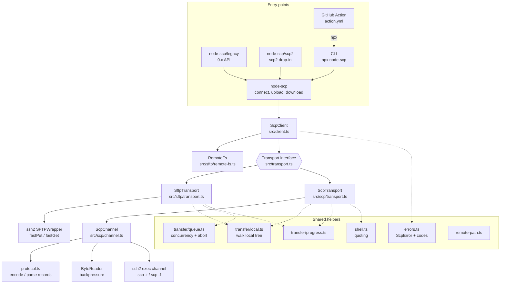
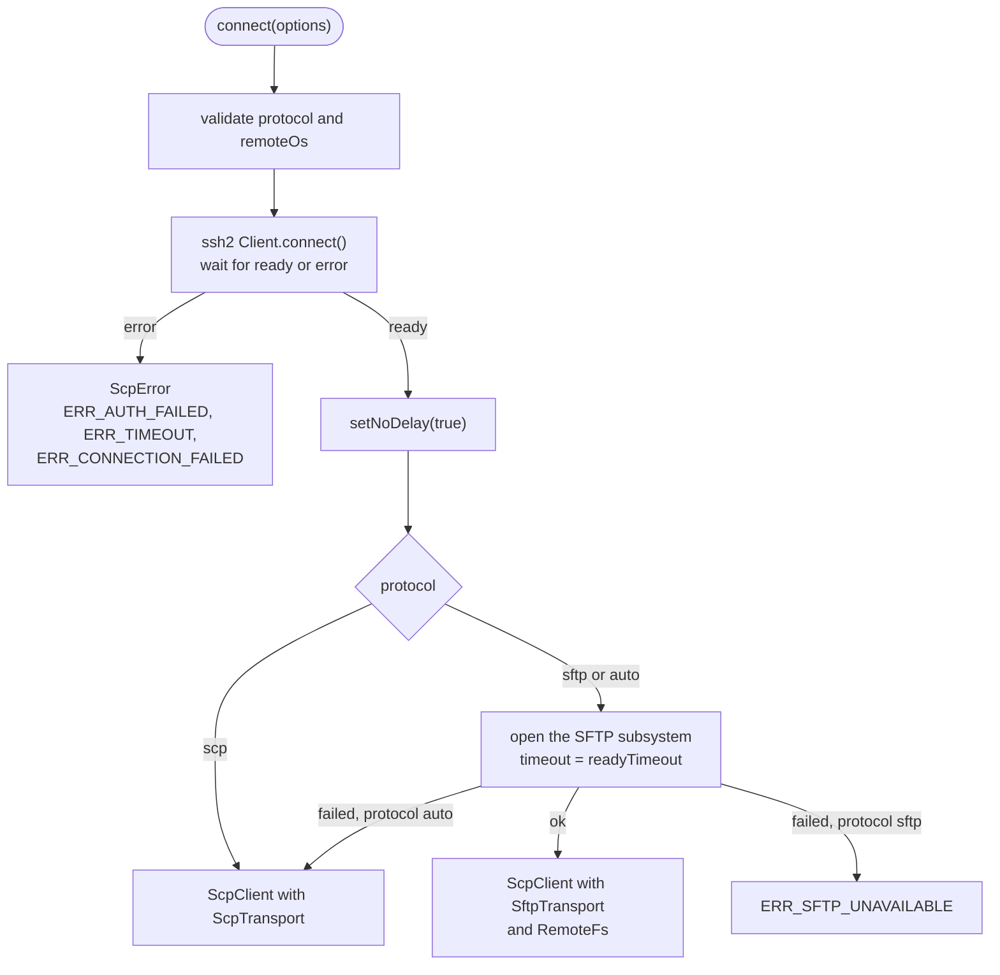
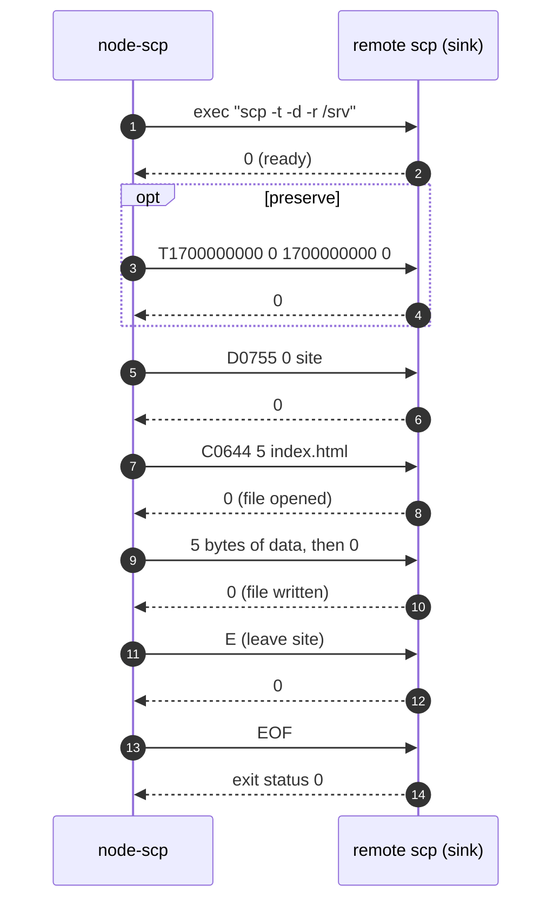
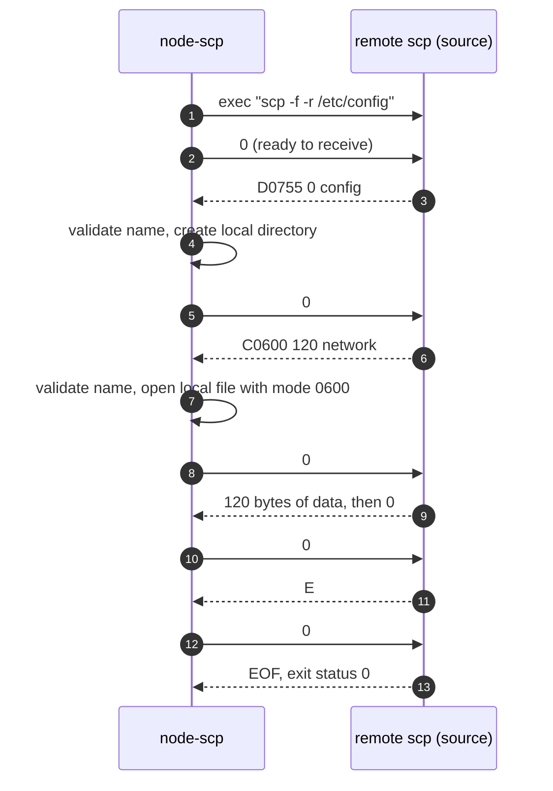
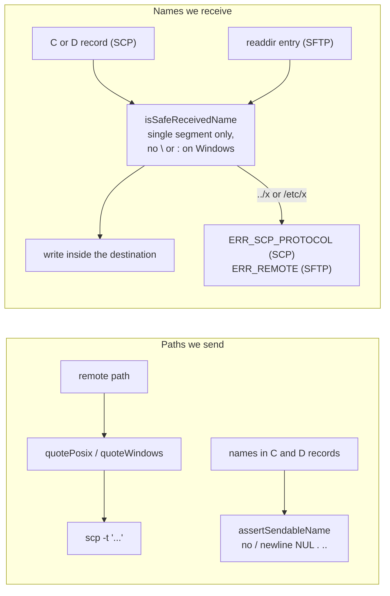
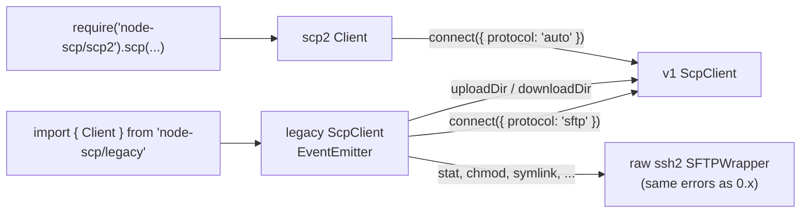
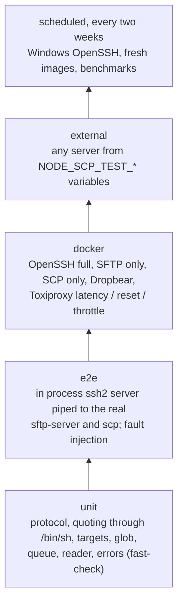
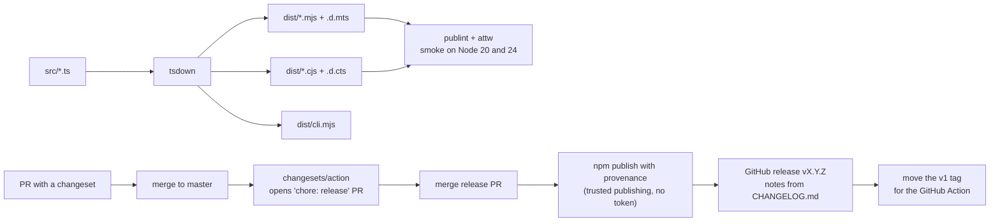

# Architecture

This document explains how node-scp is put together: which module does what, how a transfer
moves through the code, and why some decisions were made. Diagrams use Mermaid, which GitHub
renders inline.

## The big picture

node-scp copies files over SSH with one API, whatever the server offers:

- **SFTP**, the SSH file transfer subsystem. Most Linux servers have it.
- **SCP**, the classic protocol spoken by running `scp -t` or `scp -f` on the server. Dropbear
  on OpenWrt, BusyBox firmware and many network devices offer only this.

`connect()` asks the server for SFTP and falls back to SCP when it is missing. Everything above
the transport layer (progress, filters, abort, errors, the CLI) is shared by both protocols.



## Source layout

```text
src/
  index.ts            public API: connect, upload, download, types, errors
  client.ts           ScpClient and connect(): handshake, protocol negotiation, lifecycle
  transport.ts        the Transport interface both protocols implement
  types.ts            ConnectOptions, TransferOptions, TransferProgress, results
  errors.ts           ScpError, ErrorCode, mapping from ssh2, SFTP and errno errors
  target.ts           parseTarget / formatTarget for user@host:path and scp:// URIs
  shell.ts            POSIX and Windows argument quoting for remote commands
  names.ts            checks for names received from servers, modes for new copies
  remote-path.ts      path helpers for posix or win32 servers
  glob.ts             small glob matcher, used by the scp2 layer and CLI --exclude
  exec.ts             run a command and collect its output
  remote-helpers.ts   mkdir -p and "is a directory" over SFTP or a shell
  sftp/
    ops.ts            promisified SFTP calls with error mapping
    remote-fs.ts      RemoteFs: exists, stat, list, mkdir, rm, rename, realpath
    transport.ts      SftpTransport: parallel file transfers with fastPut / fastGet
  scp/
    protocol.ts       SCP control records and name validation
    reader.ts         ByteReader: pull based reads from a push based stream
    channel.ts        ScpChannel: one remote scp process, status bytes, failures
    transport.ts      ScpTransport: sink (upload) and source (download) state machines
  transfer/
    local.ts          walk local trees, create local directories, apply modes and times
    queue.ts          bounded concurrency queue with abort
    progress.ts       aggregates per file progress into TransferProgress events
  legacy/index.ts     the 0.x Client API on top of the v1 client, SFTP only
  scp2/index.ts       the scp2 API on top of the v1 client, SFTP or SCP
  cli/
    main.ts           argument parsing, auth discovery, host key pinning, output
    index.ts          the bin entry, calls main()
```

## Connecting and picking a protocol



Two details matter here:

- **`setNoDelay(true)`.** Both protocols send a small message and wait for a small reply. With
  Nagle's algorithm on, the kernel holds those messages back, and 200 small files over SCP took
  1.4 s instead of 70 ms on a local OpenSSH server. ssh2 does not set it, so node-scp does,
  unless `noDelay: false` is passed.
- **The SFTP probe has a timeout.** Some servers accept the subsystem request and then never
  answer. Without a timeout `auto` would hang.

## SFTP transfers

SFTP is request based, so parallel transfers are cheap. `SftpTransport`:

1. stats the source, and walks the tree when it is a directory (following symlinks, with loop
   detection),
2. applies `filter`,
3. creates directories top down,
4. copies files through a bounded queue (`concurrency`, default 4) with ssh2 `fastPut` /
   `fastGet`, which already pipeline 64 requests per file. Without `preserve`, a new
   destination file is created first (exclusively) with the source permission bits plus owner
   write, because ssh2 can only chmod after opening, which would ignore the umask and change
   existing files. ssh2 then opens the file again to write it, so owner write is dropped
   afterwards for read only sources. That matches what `scp` does,
5. applies full modes and times bottom up when `preserve` is set, so writing into a directory
   does not reset its mtime afterwards.

Every name in a remote listing goes through the same `isSafeReceivedName` check as names in SCP
records, see [Safety](#safety).

## SCP transfers

SCP runs one remote process per transfer and streams everything through its stdin and stdout.
Every control record and every file body is answered with one status byte: `0` OK, `1` error
(followed by a message line), `2` fatal.

### Upload (the remote side is the sink)



`upload('dist', '/srv/site')` runs the sink in the parent `/srv` and sends the tree under the
name `site`. The `-d` flag makes the sink insist that `/srv` is a directory, so a missing parent
fails with `ERR_NOT_FOUND` instead of silently creating a file called `srv`.

### Download (the remote side is the source)



`ScpTransport` keeps a stack of open directories while receiving. Records are parsed by
`protocol.ts`, and file bodies are streamed to disk through `ByteReader`, which pauses the SSH
channel when more than 1 MiB is buffered so a slow disk slows the server down instead of filling
memory.

### How SCP failures are classified

| What happens | Error |
| --- | --- |
| The server refuses the exec request | `ERR_SCP_UNAVAILABLE` |
| The command exits with 127 or prints `scp: not found` | `ERR_SCP_UNAVAILABLE` |
| The first output is not SCP, for example `This service allows sftp connections only.` | `ERR_SCP_UNAVAILABLE` |
| No byte at all within `readyTimeout` | `ERR_SCP_UNAVAILABLE` |
| Status byte `1` or `2` with a message | mapped from the message: `ERR_NOT_FOUND`, `ERR_PERMISSION_DENIED`, `ERR_IS_A_DIRECTORY`, otherwise `ERR_REMOTE` |
| A malformed record after the handshake, or an unsafe name | `ERR_SCP_PROTOCOL` |
| The channel closes in the middle | `ERR_CONNECTION_CLOSED` |

## Safety

SCP is the protocol where most client bugs turn into security bugs, so these rules are strict.
The rules for received names apply to SFTP listings too: a server is untrusted in both.



- **Remote paths reach the shell as one literal word.** POSIX paths go in single quotes (`'`
  becomes `'\''`), so `$()`, backticks, globs, `~` and spaces reach `scp` literally. Paths made
  only of `A-Za-z0-9_@%+=:,./-` need no quoting and are sent bare, which is what devices without
  a real shell expect. Windows paths are double quoted and characters that `cmd.exe` or
  PowerShell interpret even inside quotes (`"`, `%`, `!`, `^`, `$`, backtick) are refused
  (`isSafeForWindowsShell`). A property test feeds random strings
  through a real `/bin/sh` to check this.
- **Names from the server are one path segment**, in SCP records and in SFTP listings alike.
  A malicious server could otherwise send `../../.bashrc` (CVE-2019-6111). On Windows clients `:` is refused as well, since it would
  select a drive or an NTFS stream. The client also refuses a second top level entry and
  directory records when `recursive` was not requested.
- **No special mode bits without `preserve`.** New files get the permission bits only, so a
  server cannot plant a setuid file on a client that runs as root.
- **NUL bytes are rejected** before anything is sent.
- **The CLI pins host keys** with `--fingerprint` and warns when a key was not verified.

## Errors

Every error is a `ScpError` with a stable `code`, the failing `path` when there is one, and the
original error in `cause`. The mapping lives in `errors.ts`:

- SFTP status codes (`2` no such file, `3` permission denied, ...) and errno strings
  (`ENOENT`, `EACCES`, `EISDIR`, ...) become `ERR_NOT_FOUND`, `ERR_PERMISSION_DENIED`, and so on,
  so callers do not care which protocol ran.
- ssh2 connection errors are mapped by their `level` (`client-authentication`,
  `client-timeout`) and `code` (`ECONNREFUSED`, `ENOTFOUND`).
- Aborting through an `AbortSignal` always produces `ERR_ABORTED`.

## Cancellation and concurrency

`TransferOptions.signal` is checked between files and wired into every wait:

- SCP destroys the exec channel, which stops the remote process right away.
- SFTP stops scheduling new files and rejects at once. Files already in flight finish in the
  background because ssh2 cannot interrupt a `fastPut` midway.

`runQueue` in `transfer/queue.ts` rejects on the first failure and stops scheduling.

## Compatibility layers



- `node-scp/legacy` keeps the 0.x API, including its return shapes (`exists` resolves to `'d'`,
  `'-'`, `'l'` or `false`, `list` returns the old entry objects). It always uses SFTP, like 0.x.
  File operations pass ssh2 errors through untouched so existing `catch` blocks keep working.
- `node-scp/scp2` mirrors the unmaintained `scp2` package, callbacks included, but negotiates
  the protocol, so it also works with SCP only devices.

## Tests



- **unit** (`test/unit`) has no network.
- **e2e** (`test/e2e`) starts `test/harness/server.ts`, an ssh2 server that hands SFTP to the
  system `sftp-server` and exec requests to `/bin/sh`, so real OpenSSH `scp` binaries speak to
  the client. The harness can also refuse SFTP, refuse exec, or run a scripted malicious SCP
  source.
- **docker** (`test/docker`) uses testcontainers with the images in `docker/`.
- **external** (`test/external`) runs the shared scenarios in `test/scenarios.ts` against
  whatever server the environment points at.

The same scenario list (`defineTransferScenarios`) runs everywhere, so a server type only needs
a connection and a scratch directory to get full coverage.

## Build and release



## Decisions worth knowing

- **Destinations are exact.** `upload(src, dest)` makes `dest` a copy of `src`. It never puts
  things "into" `dest` because it happens to exist. That behaviour depends on server state and
  differs between protocols, so the library avoids it. The CLI and the scp2 layer add the
  familiar "trailing slash means into this directory" rule on top.
- **Remote parents must exist.** SCP has no way to create parent directories without a shell,
  and doing it silently over SFTP only would make the protocols behave differently. Use
  `client.fs.mkdir(dir, { recursive: true })` when you need it.
- **Symlinks are followed** when walking trees, with loop detection by device and inode locally
  and by `realpath` remotely. Copying symlinks as links is not possible over SCP.
- **`concurrency` is SFTP only.** SCP is one ordered stream per process. Opening several SCP
  processes in parallel would work against the per connection channel limits of small devices.
- **No `any`.** The code base is strict TypeScript with `noUncheckedIndexedAccess`.