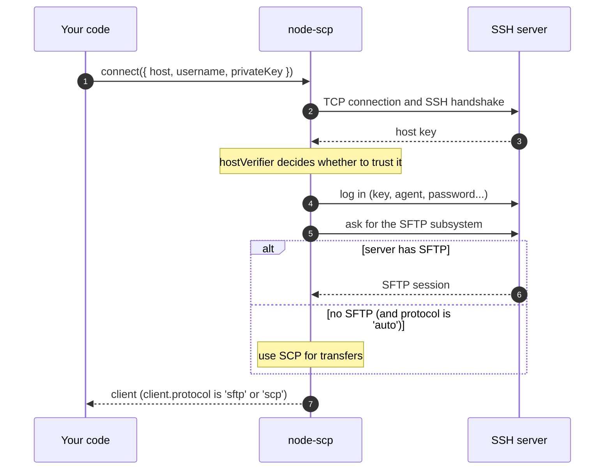

# Connecting

`connect()` gives you a ready client. Behind that one call, a few things happen in order:



## Log in

::: code-group

```ts [Private key]
import { readFileSync } from 'node:fs';

const client = await connect({
  host: 'example.com',
  username: 'deploy',
  privateKey: readFileSync('/home/me/.ssh/id_ed25519'),
});
```

```ts [Key with passphrase]
const client = await connect({
  host: 'example.com',
  username: 'deploy',
  privateKey: readFileSync('/home/me/.ssh/id_ed25519'),
  passphrase: process.env.KEY_PASSPHRASE,
});
```

```ts [ssh-agent]
const client = await connect({
  host: 'example.com',
  username: 'deploy',
  agent: process.env.SSH_AUTH_SOCK,
});
```

```ts [Password]
const client = await connect({
  host: '192.168.1.1',
  username: 'root',
  password: process.env.ROUTER_PASSWORD,
});
```

```ts [Keyboard interactive]
// Some devices ask for the password as a prompt instead.
const client = await connect({
  host: '10.0.0.10',
  username: 'admin',
  tryKeyboard: true,
  beforeConnect: (ssh) =>
    ssh.on('keyboard-interactive', (_name, _instructions, _lang, prompts, finish) =>
      finish(prompts.map(() => password)),
    ),
});
```

:::

`connect()` accepts every option of the [ssh2 client](https://github.com/mscdex/ssh2#client-methods),
so anything ssh2 can do (algorithms, keepalives, a custom socket) works here too.

## Verify the host key

The host key proves you are talking to your server and not to someone in between. ssh2 accepts
any key unless you check it, so check it in production:

```ts
import { createHash } from 'node:crypto';

// From a trusted network: ssh-keyscan -t ed25519 example.com | ssh-keygen -lf -
const expected = 'SHA256:q7Jx0fT3cM2yKpV9LrWn4sEaB8uHdZ1oGiXe6NcRtYk';

const client = await connect({
  host: 'example.com',
  username: 'deploy',
  privateKey,
  hostVerifier: (key: Buffer) =>
    `SHA256:${createHash('sha256').update(key).digest('base64').replace(/=+$/, '')}` === expected,
});
```

A wrong key fails the connection before any credentials are sent. The [CLI](./cli) and the
[GitHub Action](/recipes/github-actions) do the same check with `--fingerprint`.

## Close the connection

Every client holds a socket open, so close it when you are done.

::: code-group

```ts [await using]
{
  await using client = await connect(options);
  await client.upload('./dist', '/var/www/app', { recursive: true });
} // closed here, even after an error
```

```ts [try / finally]
const client = await connect(options);
try {
  await client.upload('./dist', '/var/www/app', { recursive: true });
} finally {
  await client.close();
}
```

:::

`close()` is safe to call twice. `client.closed` turns `true` once the connection is gone, also
when the network dropped it; later calls then fail with `ERR_NOT_CONNECTED`.

## Time limits and cancelling

- `readyTimeout` (default 20 seconds) limits the SSH handshake and login, and also how long the
  server may take to answer the SFTP or SCP start.
- `signal` cancels the whole attempt at any point:

```ts
const client = await connect({ ...options, signal: AbortSignal.timeout(10_000) });
```

## Go through a jump host

Pass a stream from another SSH connection as `sock`. The [ssh2](https://www.npmjs.com/package/ssh2)
package is installed with node-scp; add it to your own dependencies if you import it directly.

```ts
import { Client, type ClientChannel } from 'ssh2';
import { connect } from 'node-scp';

const bastion = new Client();
await new Promise<void>((resolve, reject) =>
  bastion.once('ready', resolve).once('error', reject).connect({
    host: 'bastion.example.com',
    username: 'me',
    privateKey,
  }),
);
const sock = await new Promise<ClientChannel>((resolve, reject) =>
  bastion.forwardOut('127.0.0.1', 0, '10.0.0.5', 22, (err, stream) =>
    err ? reject(err) : resolve(stream),
  ),
);

try {
  await using client = await connect({ sock, username: 'deploy', privateKey });
  await client.upload('./dist', '/srv/app', { recursive: true });
} finally {
  bastion.end();
}
```

## Options node-scp adds

| Option | Default | What it does |
| --- | --- | --- |
| `protocol` | `'auto'` | `'auto'`, `'sftp'` or `'scp'`. See [Choosing the protocol](./protocols). |
| `remoteOs` | `'posix'` | `'win32'` for Windows OpenSSH servers: backslash paths, and quoting that is safe for `cmd.exe` and PowerShell. |
| `scpCommand` | `'scp'` | The remote SCP program, for example `/usr/bin/scp` when `scp` is not on the remote `PATH`. |
| `noDelay` | `true` | Turns off Nagle's algorithm, which makes small files much faster. Leave it on. |
| `signal` | | Cancels the connection attempt. |
| `beforeConnect` | | Receives the ssh2 client before it connects, to add listeners such as `keyboard-interactive` or `banner`. |

The full list, including every inherited ssh2 option, is in the
[`ConnectOptions` reference](/api/interfaces/ConnectOptions).
