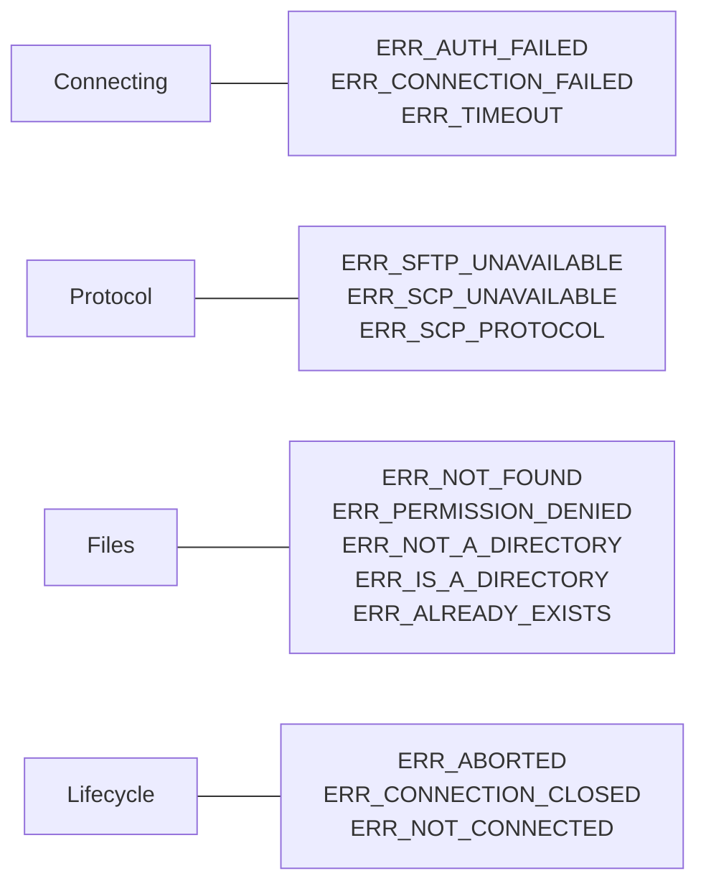

# Handling errors

Everything node-scp throws is a `ScpError` with three things you can rely on:

```ts
err.code; // a stable code such as 'ERR_NOT_FOUND', the same for SFTP and SCP
err.path; // the local or remote path involved, when there is one
err.cause; // the original error from ssh2, the server or the local filesystem
```

Branch on `code` with `isScpError()`, which also narrows the type in TypeScript:

```ts
import { ErrorCode, isScpError } from 'node-scp';

try {
  await client.download('/var/log/app.log', './app.log');
} catch (err) {
  if (isScpError(err, ErrorCode.NotFound)) {
    console.log(`nothing at ${err.path} yet`);
  } else {
    throw err;
  }
}
```

`ErrorCode.NotFound` and the string `'ERR_NOT_FOUND'` are the same value, use whichever you like.

## The codes, grouped by what went wrong



| Code | When | What to do |
| --- | --- | --- |
| `ERR_AUTH_FAILED` | The server refused the login. | Check user name, key and password. |
| `ERR_CONNECTION_FAILED` | No SSH connection: DNS, refused port, host key rejected. | Check host, port, firewall and `hostVerifier`. |
| `ERR_TIMEOUT` | The server did not answer in time. | Raise `readyTimeout` for slow devices. |
| `ERR_SFTP_UNAVAILABLE` | `protocol: 'sftp'` but the server has no SFTP. | Use `'auto'` or `'scp'`. |
| `ERR_SCP_UNAVAILABLE` | SCP was needed but the server cannot run `scp`. | Enable SCP on the device, or set `scpCommand`. |
| `ERR_SCP_PROTOCOL` | The server broke the SCP protocol or sent an unsafe file name. | Often a device quirk; try without `recursive` and `preserve`. |
| `ERR_NOT_FOUND` | A path does not exist, including a missing remote parent directory. | Create the parent first. |
| `ERR_PERMISSION_DENIED` | The user may not read or write there. | Check ownership and permissions. |
| `ERR_NOT_A_DIRECTORY` | A path you use as a folder is a file. | |
| `ERR_IS_A_DIRECTORY` | A folder where a file was expected, or `recursive` is missing. | Add `recursive: true`. |
| `ERR_ALREADY_EXISTS` | Something is already there. | |
| `ERR_ABORTED` | Your `signal` fired. | Usually expected; see [cancelling](./progress#cancel-a-transfer). |
| `ERR_CONNECTION_CLOSED` | The connection dropped during an operation. | Reconnect and retry. |
| `ERR_NOT_CONNECTED` | The client was already closed. | Create a new client. |
| `ERR_INVALID_ARGUMENT` | An option or path is invalid, or a stream does not match its declared `size`. | The message says which. |
| `ERR_UNSUPPORTED` | The SFTP server does not support the operation. | |
| `ERR_REMOTE`, `ERR_LOCAL` | Any other failure on the server or on your machine. | Look at `err.cause`. |

## Retry when the network is flaky

Connection problems are worth a retry, file problems are not:

```ts
const RETRY = new Set([ErrorCode.ConnectionFailed, ErrorCode.ConnectionClosed, ErrorCode.Timeout]);

async function deploy(attempt = 1): Promise<void> {
  try {
    await using client = await connect(options);
    await client.upload('./dist', '/var/www/app', { recursive: true });
  } catch (err) {
    if (attempt < 3 && isScpError(err) && RETRY.has(err.code)) {
      await new Promise((resolve) => setTimeout(resolve, 2 ** attempt * 1000));
      return deploy(attempt + 1);
    }
    throw err;
  }
}
```
