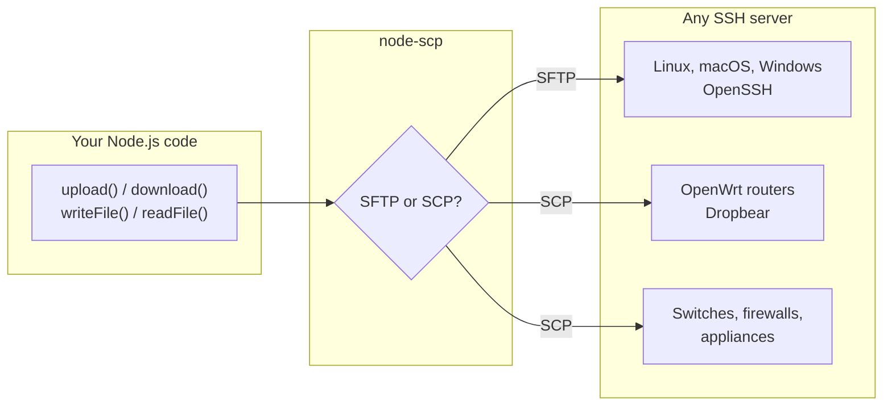

# What is node-scp?

node-scp copies files between your Node.js program and any machine you can reach over SSH. It
opens one SSH connection, then moves files with **SFTP** when the server supports it and with
the classic **SCP** protocol when it does not. Your code stays the same either way.

## Why another SSH file library?

Most Node.js libraries only speak SFTP. That is fine for a regular Linux server, but many machines
have no SFTP server at all: OpenWrt and other embedded Linux devices running Dropbear, network
equipment, minimal images. On those, SFTP libraries fail with `Unable to start subsystem: sftp`.
node-scp implements the SCP wire protocol as well, so it keeps working.

On top of that you get the things you would otherwise build yourself: recursive copies, progress
for whole trees, filters, cancellation with `AbortSignal`, typed errors that mean the same thing
on both protocols, a CLI and a GitHub Action.

## Pick your starting point

| I want to... | Use | Read |
| --- | --- | --- |
| Copy files from a Node.js program | `connect()` and the client methods | [Getting started](./getting-started) |
| Copy once and be done | `upload()` / `download()` helpers | [One call helpers](./transfers#one-call-helpers) |
| Copy from a terminal or a script | `npx node-scp` | [Command line](./cli) |
| Deploy from CI | `maitrungduc1410/node-scp-async@v1` | [GitHub Action](/recipes/github-actions) |
| Keep code written for node-scp 0.x | `node-scp/legacy` | [From node-scp 0.x](/migration/from-0.x) |
| Replace the `scp2` package | `node-scp/scp2` | [From scp2](/migration/from-scp2) |

## What it is not

node-scp focuses on moving files. If running remote commands is your main job, or you need
every corner of the SFTP protocol, another library may suit you better, and
[the comparison page](/comparison) says which. You can still run commands through
[`client.ssh`](./remote-fs#run-commands), the underlying [ssh2](https://github.com/mscdex/ssh2)
client.

## Requirements

- Node.js 22 or newer is recommended. Node 20 still works but is past its end of life.
- Any SSH server. SFTP needs the server's SFTP subsystem, SCP needs an `scp` program on the
  server. Nearly every server has at least one of the two.
