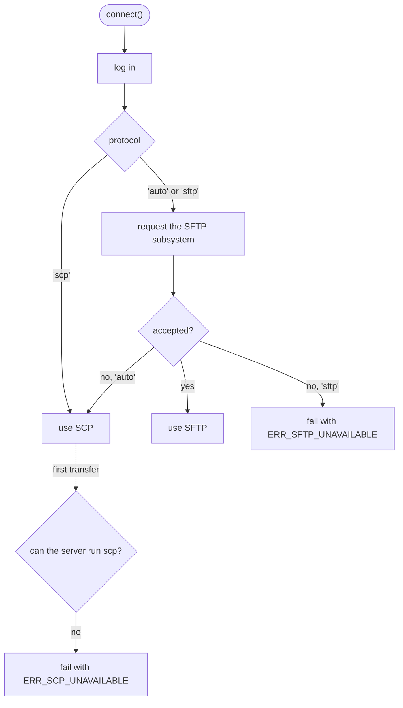

# Choosing the protocol

Short answer: you usually do not have to. The default, `protocol: 'auto'`, asks the server for
SFTP and falls back to SCP when it has none. `client.protocol` tells you which one it got.

<!--@include: ../parts/server-picker.md-->

## How `'auto'` decides



The SFTP probe costs one round trip right after login. SCP is only tried when you transfer, since
it runs the `scp` program on the server for each operation.

## What you get with each

| | SFTP | SCP |
| --- | --- | --- |
| `upload()`, `download()` | yes | yes |
| `writeFile()`, `readFile()` | yes | yes (streams without `size` are buffered) |
| `client.fs` (list, stat, mkdir, rm, rename) | yes | no, `undefined` |
| Parallel files in directory copies | yes, `concurrency` | no, one at a time |
| `total` in download progress | yes | no |
| Works on Dropbear, OpenWrt, network gear | only if an SFTP server is installed | yes |
| Works on SFTP only hosts (`ForceCommand internal-sftp`) | yes | no |

Errors use the same codes on both, so `ERR_NOT_FOUND` means "not found" whichever protocol ran.

## Force one

```ts
// Needs client.fs or many parallel files: fail early if SFTP is missing.
await connect({ ...options, protocol: 'sftp' });

// A device you know has no SFTP: skip the probe.
await connect({ ...options, protocol: 'scp' });
```

When `scp` is not on the remote `PATH`, point to it with `scpCommand: '/usr/bin/scp'`.

## Want the background?

[SCP or SFTP in 2026?](/scp-vs-sftp) explains how the two protocols work, what OpenSSH 9 changed
and where each one still wins.
