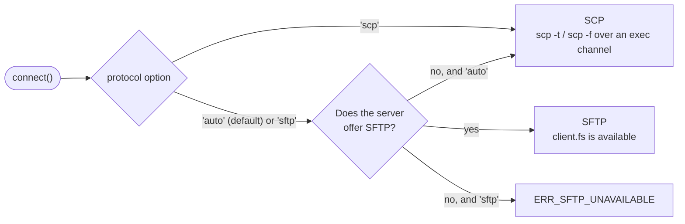

<div class="home-section vp-doc">

## Copy a folder in three lines

::: code-group

```ts [Library]
import { connect } from 'node-scp';

await using client = await connect({ host: 'example.com', username: 'deploy', privateKey });
await client.upload('./dist', '/var/www/app', { recursive: true });
```

```ts [One call]
import { upload } from 'node-scp';

await upload('./dist', 'deploy@example.com:/var/www/app', { recursive: true, privateKey });
```

```sh [CLI]
npx node-scp -r ./dist deploy@example.com:/var/www/app
```

```yaml [GitHub Action]
- uses: maitrungduc1410/node-scp-async@v1
  with:
    host: ${{ secrets.DEPLOY_HOST }}
    username: deploy
    private-key: ${{ secrets.DEPLOY_KEY }}
    source: dist/
    target: /var/www/app
```

:::

## Works with the servers you actually have

Pick a server to see what node-scp does with it.

<!--@include: ./parts/server-picker.md-->

## How it picks the protocol



## Fast where it matters

Uploads to OpenSSH on the same machine, mean of several runs. Most of the gap on small files comes
from `TCP_NODELAY`; [the comparison page](/comparison) explains it.

<BenchChart />

</div>
