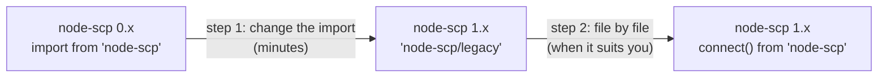

# Upgrading from node-scp 0.x

node-scp 1.0 has a new API. The old one is still shipped, so upgrading is two steps: first a one
line change, then moving to the new API whenever it suits you.



The same task in each stage:

::: code-group

```ts [0.x]
import { Client } from 'node-scp';

const client = await Client({ host, username, privateKey });
await client.uploadDir('./dist', '/var/www/app');
client.close();
```

```ts [1.x, step 1: legacy]
import { Client } from 'node-scp/legacy';

const client = await Client({ host, username, privateKey });
await client.uploadDir('./dist', '/var/www/app');
await client.close();
```

```ts [1.x, step 2: new API]
import { connect } from 'node-scp';

await using client = await connect({ host, username, privateKey });
await client.upload('./dist', '/var/www/app', { recursive: true });
```

:::

## Step 1: keep the old API

```diff
- import { Client } from 'node-scp';
+ import { Client } from 'node-scp/legacy';
```

or with CommonJS:

```diff
- const { Client } = require('node-scp');
+ const { Client } = require('node-scp/legacy');
```

The default export works too (`import Client from 'node-scp/legacy'`). Every 0.x method is
there with the same arguments and return values, and it still uses SFTP only.

A few things behave slightly differently, all of them fixes:

| 0.x | 1.x legacy layer |
| --- | --- |
| A connection error after `ready` could crash the process with an unhandled `error` event. | `error` is only emitted when you listen for it. |
| An SFTP failure right after login was thrown inside an event handler and crashed. | `Client()` rejects instead. |
| `close()` returned nothing. | It returns a promise that resolves once the connection is closed. You can ignore it. |
| The `greeting` event was emitted as `banner`. | It is emitted as `greeting`. |
| `uploadDir` and `downloadDir` copied one file at a time and skipped symlinks. | Four files in parallel, symlinks are followed. |
| `downloadDir` printed skipped entries with `console.log`. | Nothing is printed. |
| `uploadDir` and `downloadDir` created files with the default mode of the other side. | New files get the permission bits of the source, like `scp`. Existing files keep their mode. |
| `list()` took the entry type from the first letter of the long listing, which is wrong on some servers. | The type comes from the file mode. |

Node.js 20 or newer is required.

## Step 2: move to the new API

```ts
import { connect } from 'node-scp';

const client = await connect({ host, username, privateKey });
```

| 0.x | 1.x |
| --- | --- |
| `Client(options)` | `connect(options)` |
| `remoteOsType: 'win32'` | `remoteOs: 'win32'` |
| `events: { banner, ... }` | `beforeConnect: (ssh) => ssh.on('banner', ...)` |
| `uploadFile(local, remote, opts)` | `upload(local, remote)` |
| `downloadFile(remote, local, opts)` | `download(remote, local)` |
| `uploadDir(src, dest)` | `upload(src, dest, { recursive: true })` |
| `downloadDir(src, dest)` returning a message | `download(src, dest, { recursive: true })` returning `{ files, directories, bytes }` |
| `writeFile(path, data)` | `writeFile(path, data)`, also accepts streams |
| `readFile(path)` | `readFile(path)` |
| `exists(path)` resolving `'d'`, `'-'`, `'l'` or `false` | `fs.exists(path)` resolving `'directory'`, `'file'`, `'symlink'`, `'other'` or `false` |
| `stat(path)`, `lstat(path)` returning ssh2 `Stats` | `fs.stat(path)`, `fs.lstat(path)` returning `{ type, size, mode, uid, gid, atime, mtime }` with `Date` times |
| `list(path, pattern)` | `fs.list(path)`, then filter the array |
| `mkdir(path, attrs, { recursive })` | `fs.mkdir(path, { recursive, mode })` |
| `unlink(path)` | `fs.rm(path)` |
| `rmdir(path)` (always recursive) | `fs.rm(path, { recursive: true })` |
| `emptyDir(path)` | `fs.rm(path, { recursive: true, force: true })` then `fs.mkdir(path)` |
| `rename(from, to)` | `fs.rename(from, to)` |
| `realPath(path)` | `fs.realpath(path)` |
| `chmod`, `chown`, `utimes`, `setstat`, `symlink`, `readlink`, `appendFile` | the same methods on `client.sftp` (the raw ssh2 SFTP session) |
| `close()` | `await close()` or `await using` |

### Errors

0.x passed ssh2 errors through, so you had to know that SFTP code `2` means "no such file". In
1.x every error is a `ScpError`:

```ts
import { ErrorCode, isScpError } from 'node-scp';

try {
  await client.download('/missing.txt', './missing.txt');
} catch (err) {
  if (isScpError(err, ErrorCode.NotFound)) {
    // ...
  }
}
```

The original error is still available as `err.cause`.

### Destinations are exact

`upload('dist', '/srv/app', { recursive: true })` makes `/srv/app` a copy of `dist`, exactly
like `uploadDir` did. The parent (`/srv`) has to exist. For single files the destination is the
file path, never a directory to put the file into.

### New things you get

- SCP support, so the same code works on servers without SFTP.
- `onProgress`, `filter`, `concurrency`, `preserve` and `signal` for every transfer.
- `await using` for automatic cleanup.
- One shot `upload()` and `download()` helpers that take `user@host:path`.
