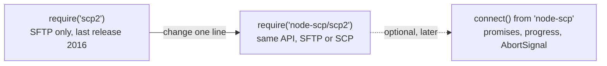

# Replacing scp2

[scp2](https://www.npmjs.com/package/scp2) has not been released since 2016 and depends on an
old ssh2. `node-scp/scp2` offers the same API on top of node-scp:

```diff
- const client = require('scp2');
+ const client = require('node-scp/scp2');
```



ES modules work too:

```js
import scp2, { scp, Client } from 'node-scp/scp2';
```

## What keeps working

```js
const { scp, Client } = require('node-scp/scp2');

// Upload a file, a directory or a glob.
scp('file.txt', 'admin:password@example.com:/home/admin/', (err) => {});
scp('dist/', 'admin:password@example.com:2222:/var/www/', (err) => {});
scp('data/*.json', { host: 'example.com', username: 'admin', password, path: '/data/' }, cb);

// Download.
scp('admin:password@example.com:/home/admin/file.txt', './', (err) => {});

// The Client class, its events and helpers.
const client = new Client({ port: 22 });
client.defaults({ host: 'example.com', username: 'admin', privateKey });
client.on('write', ({ source, destination }) => console.log(source, '->', destination));
client.mkdir('/home/admin/new/dir', (err) => {});
client.write({ destination: '/home/admin/data.txt', content: 'hello' }, (err) => {});
client.upload('local.txt', '/home/admin/remote.txt', (err) => client.close());
```

The shared default client (`require('scp2').defaults(...)`, `.upload(...)`, `.close()`) is
there as well.

## Improvements over scp2

- **SCP only servers work.** scp2 only ever used SFTP. The replacement picks SFTP or SCP for
  you, so Dropbear and embedded devices work. `mkdir` uses `mkdir -p` over SSH when there is no
  SFTP.
- **Promises.** Leave out the callback and `scp()`, `upload()`, `download()`, `mkdir()` and
  `write()` return a promise.
- **Downloads of directories** work, and a download into an existing directory keeps the file
  name.
- **Globs keep their layout.** `scp('src/**/*.js', ...)` recreates the paths below `src/` on the
  server. scp2 computed paths relative to the first match, which could place files outside the
  target.
- **Maintained dependencies** and bundled TypeScript types.

## Small differences

- During uploads and downloads, `transfer` events are emitted with
  `(null, transferred, total)`. scp2 passed each raw chunk as the first argument. `write()`
  still passes its content.
- Glob patterns support `*`, `?`, `**`, `[...]` and `{a,b}`. Names starting with a dot are not
  matched by wildcards, like the `glob` package scp2 used.
- `client.sftp(cb)` fails with `ERR_SFTP_UNAVAILABLE` on servers without SFTP.
- Errors are `ScpError` objects with a `code`, see [Handling errors](/guide/errors).

## Going further: the new API

The scp2 layer is complete, so there is no rush. When you touch the code anyway, the main API
gives you progress for whole trees, filters, cancellation and typed errors:

::: code-group

```js [scp2]
const { scp } = require('node-scp/scp2');

scp('dist/', 'deploy:secret@example.com:/var/www/app/', (err) => {
  if (err) console.error(err);
});
```

```js [node-scp]
const { upload } = require('node-scp');

await upload('dist', 'deploy@example.com:/var/www/app', {
  recursive: true,
  password: process.env.DEPLOY_PASSWORD,
});
```

:::

See [Upload and download](/guide/transfers) for how destinations work in the main API.
