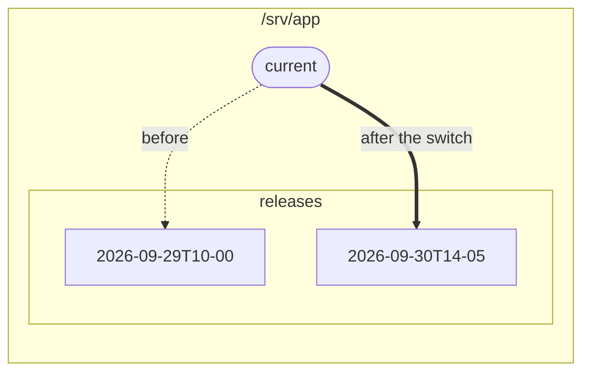

# Zero downtime deploys

Uploading straight into the folder your web server reads from leaves a window where visitors see
half old, half new files. The classic fix is a release folder per deploy and a `current` symlink
that switches in one step.



The web server serves `/srv/app/current`. Each deploy uploads a new folder next to the old ones,
then points `current` at it.

## The script

```ts
import { readFileSync } from 'node:fs';
import { connect, type ScpClient } from 'node-scp';

const root = '/srv/app';
const release = `${root}/releases/${new Date().toISOString().replace(/[:.]/g, '-')}`;

await using client = await connect({
  host: 'example.com',
  username: 'deploy',
  privateKey: readFileSync(process.env.DEPLOY_KEY_PATH!),
  protocol: 'sftp', // the cleanup below needs client.fs
});
const fs = client.fs!;

// 1. Upload the new release next to the live one. Visitors still see the old release.
await fs.mkdir(`${root}/releases`, { recursive: true });
await client.upload('./dist', release, { recursive: true });

// 2. Switch in one step: create the new link under a temporary name, then rename it over the old one.
await run(client, `ln -sfn '${release}' '${root}/current.tmp' && mv -Tf '${root}/current.tmp' '${root}/current'`);

// 3. Keep the five newest releases.
const releases = (await fs.list(`${root}/releases`)).map((entry) => entry.name).sort().reverse();
for (const old of releases.slice(5)) {
  await fs.rm(`${root}/releases/${old}`, { recursive: true });
}

function run(client: ScpClient, command: string): Promise<void> {
  return new Promise((resolve, reject) =>
    client.ssh.exec(command, (err, stream) => {
      if (err) return reject(err);
      stream.resume().stderr.resume();
      stream.on('close', (code: number) => (code === 0 ? resolve() : reject(new Error(`exit ${code}`))));
    }),
  );
}
```

## Why these steps

- **Upload first, switch last.** If the upload fails halfway, the live site is untouched. Run the
  script again and it uploads a fresh release.
- **`mv -T` over a symlink is atomic** on Linux: at every moment `current` points at a complete
  release. Replacing the link with `rm` and `ln` would leave a moment with no `current` at all.
- **Release names sort by time**, so `sort().reverse()` puts the newest first.
- **Rolling back** is the same switch pointed at an older folder.

## From GitHub Actions

Upload the release with the [GitHub Action](./github-actions), then switch the link with an `ssh`
step, or run the script above with `node` in your workflow.
