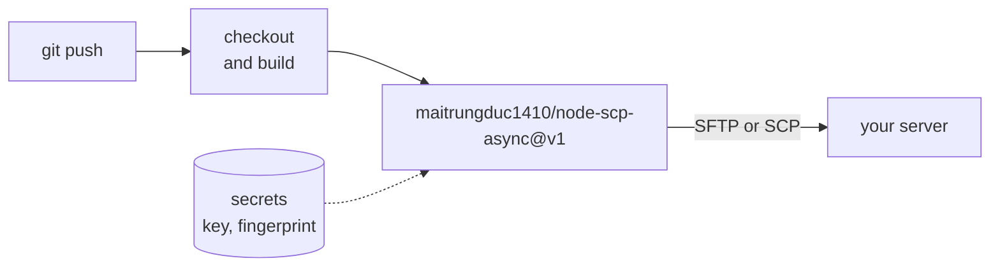

# Deploying from GitHub Actions

The repository is also a GitHub Action. It runs the node-scp CLI, so it works with SFTP servers
and SCP only devices alike.



```yaml
name: Deploy
on:
  push:
    branches: [main]

jobs:
  deploy:
    runs-on: ubuntu-latest
    steps:
      - uses: actions/checkout@v7
      - run: npm ci && npm run build
      - uses: maitrungduc1410/node-scp-async@v1
        with:
          host: ${{ secrets.DEPLOY_HOST }}
          username: deploy
          private-key: ${{ secrets.DEPLOY_KEY }}
          fingerprint: ${{ secrets.DEPLOY_HOST_FINGERPRINT }}
          source: dist/
          target: /var/www/app
          exclude: |
            *.map
            .DS_Store
```

## Inputs

| Input | Default | Description |
| --- | --- | --- |
| `host` | required | Host name or IP address. IPv6 works too. |
| `port` | `22` | SSH port. |
| `username` | required | User name. |
| `private-key` | | Private key contents. Use a secret. |
| `passphrase` | | Passphrase for the key. |
| `password` | | Password, if you cannot use a key. |
| `fingerprint` | | Expected host key, `SHA256:...`. Comma separated for several. |
| `source` | required | Paths to copy, one per line. |
| `target` | required | Destination. |
| `direction` | `upload` | `upload` or `download`. For downloads `source` is remote and `target` local. |
| `protocol` | `auto` | `auto`, `sftp` or `scp`. |
| `recursive` | `true` | Copy directories. |
| `preserve` | `false` | Keep times and full modes. New files get the source permissions either way. |
| `exclude` | | Patterns to skip, one per line. A pattern without `/` matches names at any depth. |
| `concurrency` | `4` | Parallel files over SFTP. |
| `version` | `1` | node-scp version the action runs. |

## Where files end up

The action follows `scp` rules:

- `source: dist` and `target: /var/www/app` makes `/var/www/app` a copy of `dist` when
  `/var/www/app` does not exist yet, and creates `/var/www/app/dist` when it does.
- A trailing slash on the target (`/var/www/app/`) always means "into this directory".
- Several sources always go into the target directory.

To replace a directory atomically, upload to a new release directory and switch a symlink
afterwards with an `ssh` step.

## Pin the host key

Without `fingerprint` the action accepts any host key and prints a warning. Get the value once
from a trusted network:

```sh
ssh-keyscan -t ed25519 example.com 2>/dev/null | ssh-keygen -lf -
# 256 SHA256:q7Jx0fT3cM2yKpV9LrWn4sEaB8uHdZ1oGiXe6NcRtYk example.com (ED25519)
```

Store `SHA256:q7Jx...` as a secret or variable and pass it as `fingerprint`.

## Using the CLI directly

The action is a thin wrapper, so any step with Node can do the same:

```yaml
- run: npx node-scp@1 -r --fingerprint "$FP" dist/ deploy@example.com:/var/www/app
  env:
    NODE_SCP_PRIVATE_KEY: ${{ secrets.DEPLOY_KEY }}
    FP: ${{ vars.DEPLOY_HOST_FINGERPRINT }}
```
