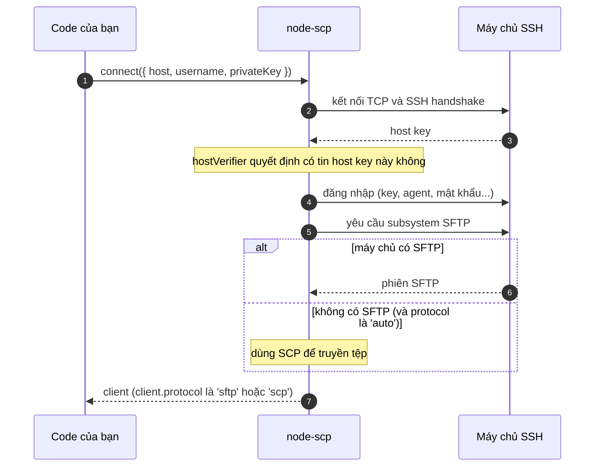

# Kết nối

`connect()` trả về một client sẵn sàng sử dụng. Đằng sau lệnh gọi đó, vài bước diễn ra theo thứ
tự:



## Đăng nhập {#log-in}

::: code-group

```ts [Private key]
import { readFileSync } from 'node:fs';

const client = await connect({
  host: 'example.com',
  username: 'deploy',
  privateKey: readFileSync('/home/me/.ssh/id_ed25519'),
});
```

```ts [Key có passphrase]
const client = await connect({
  host: 'example.com',
  username: 'deploy',
  privateKey: readFileSync('/home/me/.ssh/id_ed25519'),
  passphrase: process.env.KEY_PASSPHRASE,
});
```

```ts [ssh-agent]
const client = await connect({
  host: 'example.com',
  username: 'deploy',
  agent: process.env.SSH_AUTH_SOCK,
});
```

```ts [Mật khẩu]
const client = await connect({
  host: '192.168.1.1',
  username: 'root',
  password: process.env.ROUTER_PASSWORD,
});
```

```ts [Keyboard interactive]
// Một số thiết bị hỏi mật khẩu qua prompt thay vì nhận trực tiếp.
const client = await connect({
  host: '10.0.0.10',
  username: 'admin',
  tryKeyboard: true,
  beforeConnect: (ssh) =>
    ssh.on('keyboard-interactive', (_name, _instructions, _lang, prompts, finish) =>
      finish(prompts.map(() => password)),
    ),
});
```

:::

`connect()` nhận mọi tùy chọn của [client ssh2](https://github.com/mscdex/ssh2#client-methods),
nên những gì ssh2 làm được (thuật toán, keepalive, socket tùy chỉnh) đều dùng được ở đây.

## Xác minh host key {#verify-the-host-key}

Host key chứng minh bạn đang nói chuyện với đúng máy chủ của mình chứ không phải một kẻ đứng giữa.
ssh2 chấp nhận mọi key nếu bạn không kiểm tra, vì vậy hãy kiểm tra khi chạy production:

```ts
import { createHash } from 'node:crypto';

// Lấy từ một mạng tin cậy: ssh-keyscan -t ed25519 example.com | ssh-keygen -lf -
const expected = 'SHA256:q7Jx0fT3cM2yKpV9LrWn4sEaB8uHdZ1oGiXe6NcRtYk';

const client = await connect({
  host: 'example.com',
  username: 'deploy',
  privateKey,
  hostVerifier: (key: Buffer) =>
    `SHA256:${createHash('sha256').update(key).digest('base64').replace(/=+$/, '')}` === expected,
});
```

Nếu key không khớp, kết nối thất bại trước khi bất kỳ thông tin đăng nhập nào được gửi đi.
[CLI](./cli) và [GitHub Action](/vi/recipes/github-actions) cũng kiểm tra như vậy với
`--fingerprint`.

## Đóng kết nối {#close-the-connection}

Mỗi client giữ một socket mở, nên hãy đóng nó khi dùng xong.

::: code-group

```ts [await using]
{
  await using client = await connect(options);
  await client.upload('./dist', '/var/www/app', { recursive: true });
} // đóng tại đây, kể cả khi có lỗi
```

```ts [try / finally]
const client = await connect(options);
try {
  await client.upload('./dist', '/var/www/app', { recursive: true });
} finally {
  await client.close();
}
```

:::

Gọi `close()` hai lần vẫn an toàn. `client.closed` chuyển thành `true` khi kết nối đã đóng, kể cả
khi mạng làm rớt kết nối; các lệnh gọi sau đó sẽ báo lỗi `ERR_NOT_CONNECTED`.

## Giới hạn thời gian và hủy {#time-limits-and-cancelling}

- `readyTimeout` (mặc định 20 giây) giới hạn thời gian SSH handshake và đăng nhập, đồng thời giới
  hạn thời gian máy chủ được phép phản hồi khi khởi động SFTP hoặc SCP.
- `signal` hủy toàn bộ quá trình kết nối ở bất kỳ thời điểm nào:

```ts
const client = await connect({ ...options, signal: AbortSignal.timeout(10_000) });
```

## Đi qua jump host {#go-through-a-jump-host}

Truyền một stream từ một kết nối SSH khác vào `sock`. Gói [ssh2](https://www.npmjs.com/package/ssh2)
được cài cùng node-scp; nếu bạn import nó trực tiếp, hãy thêm nó vào dependencies của dự án.

```ts
import { Client, type ClientChannel } from 'ssh2';
import { connect } from 'node-scp';

const bastion = new Client();
await new Promise<void>((resolve, reject) =>
  bastion.once('ready', resolve).once('error', reject).connect({
    host: 'bastion.example.com',
    username: 'me',
    privateKey,
  }),
);
const sock = await new Promise<ClientChannel>((resolve, reject) =>
  bastion.forwardOut('127.0.0.1', 0, '10.0.0.5', 22, (err, stream) =>
    err ? reject(err) : resolve(stream),
  ),
);

try {
  await using client = await connect({ sock, username: 'deploy', privateKey });
  await client.upload('./dist', '/srv/app', { recursive: true });
} finally {
  bastion.end();
}
```

## Các tùy chọn node-scp bổ sung {#options-node-scp-adds}

| Tùy chọn | Mặc định | Tác dụng |
| --- | --- | --- |
| `protocol` | `'auto'` | `'auto'`, `'sftp'` hoặc `'scp'`. Xem [Chọn giao thức](./protocols). |
| `remoteOs` | `'posix'` | `'win32'` cho máy chủ Windows chạy OpenSSH: đường dẫn dùng dấu gạch chéo ngược, và tham số được đặt trong dấu nháy theo cách an toàn cho `cmd.exe` lẫn PowerShell. |
| `scpCommand` | `'scp'` | Chương trình SCP trên máy chủ, ví dụ `/usr/bin/scp` khi `scp` không nằm trong `PATH` của máy chủ. |
| `noDelay` | `true` | Tắt thuật toán Nagle, giúp tệp nhỏ truyền nhanh hơn nhiều. Hãy để nguyên. |
| `signal` | | Hủy quá trình kết nối. |
| `beforeConnect` | | Nhận client ssh2 trước khi kết nối, để gắn listener như `keyboard-interactive` hoặc `banner`. |

Danh sách đầy đủ, gồm cả mọi tùy chọn kế thừa từ ssh2, có trong
[tài liệu `ConnectOptions`](/api/interfaces/ConnectOptions).
