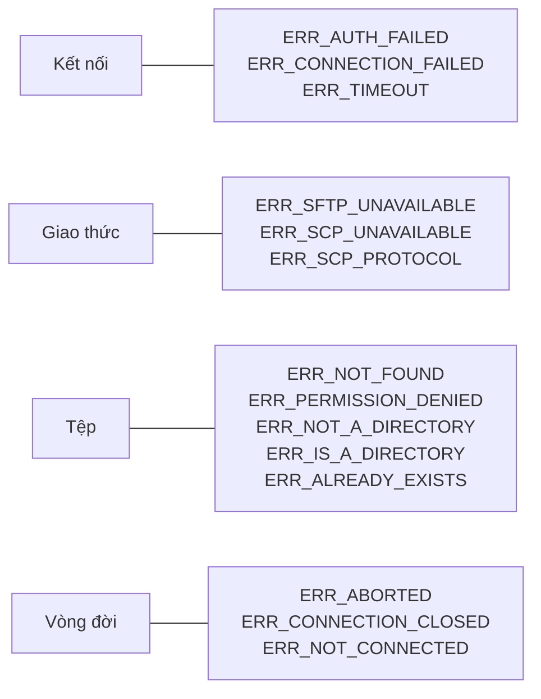

# Xử lý lỗi

Mọi lỗi node-scp throw ra đều là `ScpError` với ba thứ bạn có thể dựa vào:

```ts
err.code; // mã ổn định như 'ERR_NOT_FOUND', giống nhau cho SFTP và SCP
err.path; // đường dẫn cục bộ hoặc trên máy chủ liên quan, nếu có
err.cause; // lỗi gốc từ ssh2, từ máy chủ hoặc từ hệ thống tệp cục bộ
```

Rẽ nhánh theo `code` bằng `isScpError()`, hàm này đồng thời thu hẹp kiểu trong TypeScript:

```ts
import { ErrorCode, isScpError } from 'node-scp';

try {
  await client.download('/var/log/app.log', './app.log');
} catch (err) {
  if (isScpError(err, ErrorCode.NotFound)) {
    console.log(`nothing at ${err.path} yet`);
  } else {
    throw err;
  }
}
```

`ErrorCode.NotFound` và chuỗi `'ERR_NOT_FOUND'` là cùng một giá trị, bạn thích dùng cái nào cũng
được.

## Các mã lỗi, nhóm theo loại sự cố {#the-codes-grouped-by-what-went-wrong}



| Mã | Khi nào | Nên làm gì |
| --- | --- | --- |
| `ERR_AUTH_FAILED` | Máy chủ từ chối đăng nhập. | Kiểm tra tên người dùng, key và mật khẩu. |
| `ERR_CONNECTION_FAILED` | Không tạo được kết nối SSH: lỗi DNS, port bị từ chối, host key không được chấp nhận. | Kiểm tra host, port, tường lửa và `hostVerifier`. |
| `ERR_TIMEOUT` | Máy chủ không phản hồi kịp thời. | Tăng `readyTimeout` cho thiết bị chậm. |
| `ERR_SFTP_UNAVAILABLE` | Đặt `protocol: 'sftp'` nhưng máy chủ không có SFTP. | Dùng `'auto'` hoặc `'scp'`. |
| `ERR_SCP_UNAVAILABLE` | Cần SCP nhưng máy chủ không chạy được `scp`. | Bật SCP trên thiết bị, hoặc đặt `scpCommand`. |
| `ERR_SCP_PROTOCOL` | Máy chủ vi phạm giao thức SCP hoặc gửi tên tệp không an toàn. | Thường do đặc thù của thiết bị; thử bỏ `recursive` và `preserve`. |
| `ERR_NOT_FOUND` | Đường dẫn không tồn tại, kể cả khi thiếu thư mục cha trên máy chủ. | Tạo thư mục cha trước. |
| `ERR_PERMISSION_DENIED` | Người dùng không được đọc hoặc ghi ở đó. | Kiểm tra chủ sở hữu và quyền truy cập. |
| `ERR_NOT_A_DIRECTORY` | Một đường dẫn bạn dùng như thư mục thực ra là tệp. | |
| `ERR_IS_A_DIRECTORY` | Gặp thư mục ở chỗ cần tệp, hoặc thiếu `recursive`. | Thêm `recursive: true`. |
| `ERR_ALREADY_EXISTS` | Đã có thứ gì đó ở đó. | |
| `ERR_ABORTED` | `signal` của bạn đã được kích hoạt. | Thường là chủ ý; xem [cách hủy](./progress#cancel-a-transfer). |
| `ERR_CONNECTION_CLOSED` | Kết nối bị rớt khi đang thực hiện thao tác. | Kết nối lại và thử lại. |
| `ERR_NOT_CONNECTED` | Client đã bị đóng từ trước. | Tạo client mới. |
| `ERR_INVALID_ARGUMENT` | Một tùy chọn hoặc đường dẫn không hợp lệ, hoặc stream không khớp với `size` đã khai báo. | Thông báo lỗi sẽ cho biết cụ thể. |
| `ERR_UNSUPPORTED` | SFTP server không hỗ trợ thao tác này. | |
| `ERR_REMOTE`, `ERR_LOCAL` | Mọi lỗi khác trên máy chủ hoặc trên máy của bạn. | Xem `err.cause`. |

## Thử lại khi mạng chập chờn {#retry-when-the-network-is-flaky}

Lỗi kết nối thì đáng để thử lại, lỗi về tệp thì không:

```ts
const RETRY = new Set([ErrorCode.ConnectionFailed, ErrorCode.ConnectionClosed, ErrorCode.Timeout]);

async function deploy(attempt = 1): Promise<void> {
  try {
    await using client = await connect(options);
    await client.upload('./dist', '/var/www/app', { recursive: true });
  } catch (err) {
    if (attempt < 3 && isScpError(err) && RETRY.has(err.code)) {
      await new Promise((resolve) => setTimeout(resolve, 2 ** attempt * 1000));
      return deploy(attempt + 1);
    }
    throw err;
  }
}
```
