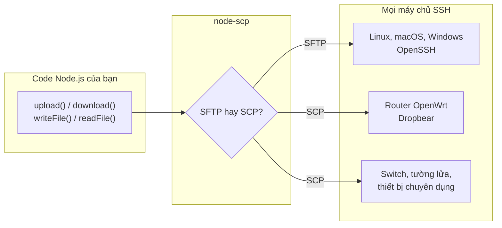

# node-scp là gì?

node-scp sao chép tệp giữa chương trình Node.js của bạn và bất kỳ máy nào bạn truy cập được qua
SSH. Thư viện mở một kết nối SSH, rồi truyền tệp bằng **SFTP** khi máy chủ hỗ trợ và bằng giao
thức **SCP** cổ điển khi máy chủ không hỗ trợ. Code của bạn vẫn giữ nguyên trong cả hai trường hợp.

## Tại sao lại thêm một thư viện truyền tệp qua SSH? {#why-another-ssh-file-library}

Hầu hết thư viện Node.js chỉ hỗ trợ SFTP. Với một máy chủ Linux thông thường thì không sao, nhưng
rất nhiều máy hoàn toàn không có SFTP server: OpenWrt và các thiết bị Linux nhúng khác chạy
Dropbear, thiết bị mạng, các image tối giản. Trên những máy đó, thư viện SFTP sẽ báo lỗi
`Unable to start subsystem: sftp`. node-scp cài đặt cả giao thức SCP nên vẫn chạy bình thường.

Ngoài ra bạn có sẵn những thứ lẽ ra phải tự viết: sao chép đệ quy, theo dõi tiến độ cho cả cây
thư mục, bộ lọc, hủy bằng `AbortSignal`, lỗi có kiểu mang cùng ý nghĩa trên cả hai giao thức, một
CLI và một GitHub Action.

## Bắt đầu từ đâu {#pick-your-starting-point}

| Tôi muốn... | Dùng | Đọc |
| --- | --- | --- |
| Sao chép tệp từ một chương trình Node.js | `connect()` và các method của client | [Bắt đầu](./getting-started) |
| Sao chép một lần rồi thôi | Các hàm tiện ích `upload()` / `download()` | [Hàm tiện ích một lệnh gọi](./transfers#one-call-helpers) |
| Sao chép từ terminal hoặc script | `npx node-scp` | [Dòng lệnh](./cli) |
| Deploy từ CI | `maitrungduc1410/node-scp-async@v1` | [GitHub Action](/vi/recipes/github-actions) |
| Giữ nguyên code viết cho node-scp 0.x | `node-scp/legacy` | [Từ node-scp 0.x](/vi/migration/from-0.x) |
| Thay thế gói `scp2` | `node-scp/scp2` | [Từ scp2](/vi/migration/from-scp2) |

## node-scp không dành cho việc gì {#what-it-is-not}

node-scp tập trung vào việc truyền tệp. Nếu việc chính của bạn là chạy lệnh từ xa, hoặc bạn cần
mọi ngóc ngách của giao thức SFTP, có thể một thư viện khác sẽ hợp hơn, và
[trang so sánh](/vi/comparison) sẽ cho bạn biết là thư viện nào. Bạn vẫn có thể chạy lệnh qua
[`client.ssh`](./remote-fs#run-commands), tức client [ssh2](https://github.com/mscdex/ssh2) bên
dưới.

## Yêu cầu {#requirements}

- Nên dùng Node.js 22 trở lên. Node 20 vẫn chạy được nhưng đã hết vòng đời hỗ trợ.
- Bất kỳ máy chủ SSH nào. SFTP cần subsystem SFTP trên máy chủ, SCP cần chương trình `scp` trên
  máy chủ. Gần như máy chủ nào cũng có ít nhất một trong hai.
