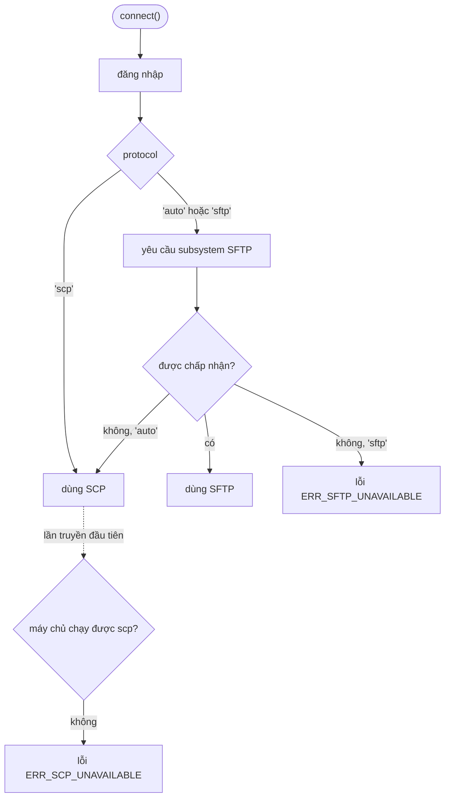

# Chọn giao thức

Trả lời ngắn gọn: thường thì bạn không cần chọn. Giá trị mặc định `protocol: 'auto'` sẽ yêu cầu
SFTP từ máy chủ và chuyển sang SCP khi máy chủ không có. `client.protocol` cho bạn biết giao thức
nào đã được chọn.

<!--@include: ../parts/server-picker.md-->

## `'auto'` quyết định thế nào {#how-auto-decides}



Bước dò SFTP tốn một round trip ngay sau khi đăng nhập. SCP chỉ được thử khi bạn thực sự truyền
tệp, vì mỗi thao tác SCP đều chạy chương trình `scp` trên máy chủ.

## Mỗi giao thức cho bạn những gì {#what-you-get-with-each}

| | SFTP | SCP |
| --- | --- | --- |
| `upload()`, `download()` | có | có |
| `writeFile()`, `readFile()` | có | có (stream không có `size` sẽ được đọc hết vào bộ nhớ) |
| `client.fs` (list, stat, mkdir, rm, rename) | có | không, là `undefined` |
| Sao chép song song nhiều tệp trong thư mục | có, qua `concurrency` | không, từng tệp một |
| `total` trong tiến độ tải xuống | có | không |
| Chạy trên Dropbear, OpenWrt, thiết bị mạng | chỉ khi có cài SFTP server | có |
| Chạy trên máy chủ chỉ cho SFTP (`ForceCommand internal-sftp`) | có | không |

Lỗi dùng cùng một bộ mã trên cả hai giao thức, nên `ERR_NOT_FOUND` luôn nghĩa là "không tìm thấy"
dù giao thức nào đang chạy.

## Ép dùng một giao thức {#force-one}

```ts
// Cần client.fs hoặc sao chép song song nhiều tệp: báo lỗi sớm nếu thiếu SFTP.
await connect({ ...options, protocol: 'sftp' });

// Thiết bị bạn biết chắc không có SFTP: bỏ qua bước dò.
await connect({ ...options, protocol: 'scp' });
```

Khi `scp` không nằm trong `PATH` của máy chủ, hãy chỉ đường dẫn tới nó bằng
`scpCommand: '/usr/bin/scp'`.

## Muốn tìm hiểu sâu hơn? {#want-the-background}

[SCP hay SFTP vào năm 2026?](/vi/scp-vs-sftp) giải thích cách hai giao thức hoạt động, OpenSSH 9
đã thay đổi những gì và mỗi giao thức vẫn mạnh hơn ở đâu.
