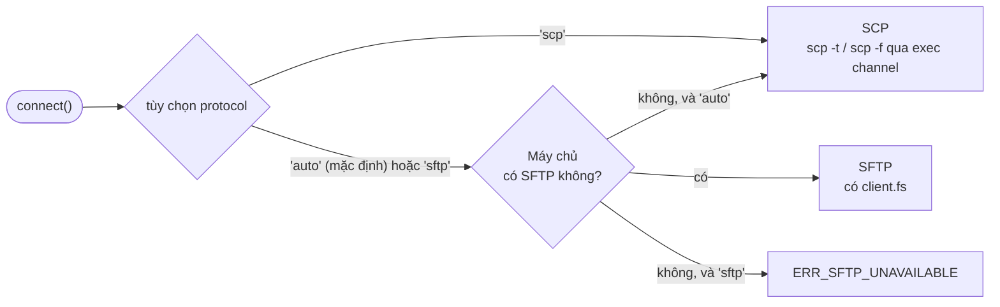

<div class="home-section vp-doc">

## Sao chép một thư mục chỉ với ba dòng {#copy-a-folder-in-three-lines}

::: code-group

```ts [Thư viện]
import { connect } from 'node-scp';

await using client = await connect({ host: 'example.com', username: 'deploy', privateKey });
await client.upload('./dist', '/var/www/app', { recursive: true });
```

```ts [Một lệnh gọi]
import { upload } from 'node-scp';

await upload('./dist', 'deploy@example.com:/var/www/app', { recursive: true, privateKey });
```

```sh [CLI]
npx node-scp -r ./dist deploy@example.com:/var/www/app
```

```yaml [GitHub Action]
- uses: maitrungduc1410/node-scp-async@v1
  with:
    host: ${{ secrets.DEPLOY_HOST }}
    username: deploy
    private-key: ${{ secrets.DEPLOY_KEY }}
    source: dist/
    target: /var/www/app
```

:::

## Chạy được với những máy chủ bạn đang dùng {#works-with-the-servers-you-actually-have}

Chọn một loại máy chủ để xem node-scp xử lý thế nào.

<!--@include: ./parts/server-picker.md-->

## Cách chọn giao thức {#how-it-picks-the-protocol}



## Nhanh ở những chỗ quan trọng {#fast-where-it-matters}

Thời gian tải lên một máy chủ OpenSSH chạy trên cùng máy, lấy trung bình nhiều lần chạy. Phần lớn
chênh lệch với tệp nhỏ đến từ `TCP_NODELAY`; [trang so sánh](/vi/comparison) giải thích chi tiết.

<BenchChart />

</div>
