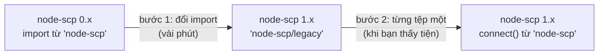

# Nâng cấp từ node-scp 0.x

node-scp 1.0 có API mới. API cũ vẫn được phát hành kèm theo, nên việc nâng cấp gồm hai bước:
trước tiên là đổi một dòng, sau đó chuyển sang API mới bất cứ khi nào bạn thấy tiện.



Cùng một công việc ở từng giai đoạn:

::: code-group

```ts [0.x]
import { Client } from 'node-scp';

const client = await Client({ host, username, privateKey });
await client.uploadDir('./dist', '/var/www/app');
client.close();
```

```ts [1.x, bước 1: legacy]
import { Client } from 'node-scp/legacy';

const client = await Client({ host, username, privateKey });
await client.uploadDir('./dist', '/var/www/app');
await client.close();
```

```ts [1.x, bước 2: API mới]
import { connect } from 'node-scp';

await using client = await connect({ host, username, privateKey });
await client.upload('./dist', '/var/www/app', { recursive: true });
```

:::

## Bước 1: giữ nguyên API cũ {#step-1-keep-the-old-api}

```diff
- import { Client } from 'node-scp';
+ import { Client } from 'node-scp/legacy';
```

hoặc với CommonJS:

```diff
- const { Client } = require('node-scp');
+ const { Client } = require('node-scp/legacy');
```

Default export cũng dùng được (`import Client from 'node-scp/legacy'`). Mọi method của 0.x đều có
mặt với cùng tham số và giá trị trả về, và lớp này vẫn chỉ dùng SFTP.

Có vài chỗ hoạt động hơi khác, tất cả đều là bản sửa lỗi:

| 0.x | Lớp legacy của 1.x |
| --- | --- |
| Lỗi kết nối xảy ra sau `ready` có thể làm process crash vì event `error` không được xử lý. | `error` chỉ được emit khi bạn có lắng nghe nó. |
| Lỗi SFTP ngay sau khi đăng nhập bị throw bên trong event handler và gây crash. | `Client()` reject thay vì crash. |
| `close()` không trả về gì. | Trả về một promise resolve khi kết nối đã đóng. Bạn có thể bỏ qua nó. |
| Event `greeting` bị emit dưới tên `banner`. | Được emit đúng tên `greeting`. |
| `uploadDir` và `downloadDir` sao chép từng tệp một và bỏ qua symlink. | Bốn tệp song song, symlink được đi theo tới đích. |
| `downloadDir` in các mục bị bỏ qua bằng `console.log`. | Không in gì cả. |
| `uploadDir` và `downloadDir` tạo tệp với mode mặc định của phía bên kia. | Tệp mới nhận các bit quyền của tệp nguồn, giống `scp`. Tệp đã có giữ nguyên mode. |
| `list()` lấy loại mục từ ký tự đầu tiên của danh sách dạng dài (`ls -l`), cách này sai trên một số máy chủ. | Loại mục được lấy từ file mode. |

Yêu cầu Node.js 20 trở lên.

## Bước 2: chuyển sang API mới {#step-2-move-to-the-new-api}

```ts
import { connect } from 'node-scp';

const client = await connect({ host, username, privateKey });
```

| 0.x | 1.x |
| --- | --- |
| `Client(options)` | `connect(options)` |
| `remoteOsType: 'win32'` | `remoteOs: 'win32'` |
| `events: { banner, ... }` | `beforeConnect: (ssh) => ssh.on('banner', ...)` |
| `uploadFile(local, remote, opts)` | `upload(local, remote)` |
| `downloadFile(remote, local, opts)` | `download(remote, local)` |
| `uploadDir(src, dest)` | `upload(src, dest, { recursive: true })` |
| `downloadDir(src, dest)` trả về một thông báo | `download(src, dest, { recursive: true })` trả về `{ files, directories, bytes }` |
| `writeFile(path, data)` | `writeFile(path, data)`, nhận thêm cả stream |
| `readFile(path)` | `readFile(path)` |
| `exists(path)` trả về `'d'`, `'-'`, `'l'` hoặc `false` | `fs.exists(path)` trả về `'directory'`, `'file'`, `'symlink'`, `'other'` hoặc `false` |
| `stat(path)`, `lstat(path)` trả về `Stats` của ssh2 | `fs.stat(path)`, `fs.lstat(path)` trả về `{ type, size, mode, uid, gid, atime, mtime }` với thời gian kiểu `Date` |
| `list(path, pattern)` | `fs.list(path)`, rồi tự lọc mảng kết quả |
| `mkdir(path, attrs, { recursive })` | `fs.mkdir(path, { recursive, mode })` |
| `unlink(path)` | `fs.rm(path)` |
| `rmdir(path)` (luôn đệ quy) | `fs.rm(path, { recursive: true })` |
| `emptyDir(path)` | `fs.rm(path, { recursive: true, force: true })` rồi `fs.mkdir(path)` |
| `rename(from, to)` | `fs.rename(from, to)` |
| `realPath(path)` | `fs.realpath(path)` |
| `chmod`, `chown`, `utimes`, `setstat`, `symlink`, `readlink`, `appendFile` | các method cùng tên trên `client.sftp` (phiên SFTP gốc của ssh2) |
| `close()` | `await close()` hoặc `await using` |

### Lỗi {#errors}

0.x trả nguyên lỗi của ssh2 ra ngoài, nên bạn phải biết rằng mã SFTP `2` nghĩa là "không có tệp
này". Ở 1.x, mọi lỗi đều là `ScpError`:

```ts
import { ErrorCode, isScpError } from 'node-scp';

try {
  await client.download('/missing.txt', './missing.txt');
} catch (err) {
  if (isScpError(err, ErrorCode.NotFound)) {
    // ...
  }
}
```

Lỗi gốc vẫn có trong `err.cause`.

### Đích là đường dẫn chính xác {#destinations-are-exact}

`upload('dist', '/srv/app', { recursive: true })` làm cho `/srv/app` trở thành bản sao của
`dist`, đúng như `uploadDir` trước đây. Thư mục cha (`/srv`) phải có sẵn. Với tệp đơn lẻ, đích là
đường dẫn của chính tệp đó, không bao giờ là thư mục để bỏ tệp vào.

### Những gì bạn có thêm {#new-things-you-get}

- Hỗ trợ SCP, nên cùng một đoạn code chạy được trên máy chủ không có SFTP.
- `onProgress`, `filter`, `concurrency`, `preserve` và `signal` cho mọi lần truyền tệp.
- `await using` để tự động dọn dẹp.
- Các hàm tiện ích `upload()` và `download()` một lệnh gọi, nhận dạng `user@host:path`.
