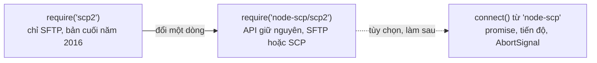

# Thay thế scp2

[scp2](https://www.npmjs.com/package/scp2) không có bản phát hành mới nào từ năm 2016 và phụ thuộc
vào một phiên bản ssh2 cũ. `node-scp/scp2` cung cấp đúng API đó, chạy trên nền node-scp:

```diff
- const client = require('scp2');
+ const client = require('node-scp/scp2');
```



ES module cũng dùng được:

```js
import scp2, { scp, Client } from 'node-scp/scp2';
```

## Những gì vẫn chạy như cũ {#what-keeps-working}

```js
const { scp, Client } = require('node-scp/scp2');

// Tải lên một tệp, một thư mục hoặc một glob.
scp('file.txt', 'admin:password@example.com:/home/admin/', (err) => {});
scp('dist/', 'admin:password@example.com:2222:/var/www/', (err) => {});
scp('data/*.json', { host: 'example.com', username: 'admin', password, path: '/data/' }, cb);

// Tải xuống.
scp('admin:password@example.com:/home/admin/file.txt', './', (err) => {});

// Class Client, các event và hàm tiện ích của nó.
const client = new Client({ port: 22 });
client.defaults({ host: 'example.com', username: 'admin', privateKey });
client.on('write', ({ source, destination }) => console.log(source, '->', destination));
client.mkdir('/home/admin/new/dir', (err) => {});
client.write({ destination: '/home/admin/data.txt', content: 'hello' }, (err) => {});
client.upload('local.txt', '/home/admin/remote.txt', (err) => client.close());
```

Client mặc định dùng chung (`require('scp2').defaults(...)`, `.upload(...)`, `.close()`) cũng có
đầy đủ.

## Cải tiến so với scp2 {#improvements-over-scp2}

- **Chạy được trên máy chủ chỉ có SCP.** scp2 lúc nào cũng chỉ dùng SFTP. Bản thay thế tự chọn SFTP
  hoặc SCP cho bạn, nên Dropbear và các thiết bị nhúng đều chạy được. Khi không có SFTP, `mkdir`
  dùng `mkdir -p` qua SSH.
- **Promise.** Nếu bỏ callback, `scp()`, `upload()`, `download()`, `mkdir()` và `write()` sẽ trả
  về một promise.
- **Tải xuống thư mục** chạy được, và khi tải vào một thư mục đã có thì tên tệp được giữ nguyên.
- **Glob giữ nguyên cấu trúc thư mục.** `scp('src/**/*.js', ...)` tái tạo trên máy chủ đúng các
  đường dẫn bên dưới `src/`. scp2 tính đường dẫn tương đối so với kết quả khớp đầu tiên, nên có
  thể đặt tệp ra ngoài thư mục đích.
- **Dependency được bảo trì** và có sẵn type cho TypeScript.

## Một vài khác biệt nhỏ {#small-differences}

- Trong lúc tải lên và tải xuống, event `transfer` được emit với `(null, transferred, total)`.
  scp2 truyền từng chunk thô làm tham số đầu tiên. `write()` vẫn truyền nội dung của nó.
- Mẫu glob hỗ trợ `*`, `?`, `**`, `[...]` và `{a,b}`. Ký tự đại diện không khớp với tên bắt đầu
  bằng dấu chấm, giống gói `glob` mà scp2 từng dùng.
- `client.sftp(cb)` báo lỗi `ERR_SFTP_UNAVAILABLE` trên máy chủ không có SFTP.
- Lỗi là object `ScpError` có `code`, xem [Xử lý lỗi](/vi/guide/errors).

## Đi xa hơn: API mới {#going-further-the-new-api}

Lớp scp2 đã đầy đủ, nên bạn không cần vội. Khi có dịp sửa code, API chính cho bạn tiến độ cho cả
cây thư mục, bộ lọc, khả năng hủy và lỗi có kiểu:

::: code-group

```js [scp2]
const { scp } = require('node-scp/scp2');

scp('dist/', 'deploy:secret@example.com:/var/www/app/', (err) => {
  if (err) console.error(err);
});
```

```js [node-scp]
const { upload } = require('node-scp');

await upload('dist', 'deploy@example.com:/var/www/app', {
  recursive: true,
  password: process.env.DEPLOY_PASSWORD,
});
```

:::

Xem [Tải lên và tải xuống](/vi/guide/transfers) để biết đích hoạt động thế nào trong API chính.
