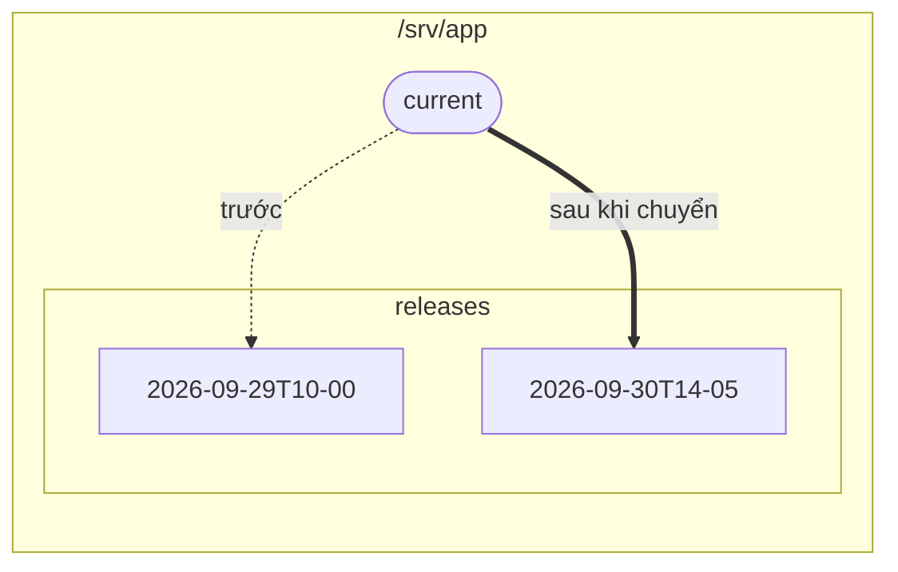

# Deploy không downtime

Tải thẳng lên thư mục mà web server đang đọc sẽ tạo ra một khoảng thời gian khách truy cập thấy
nửa tệp cũ, nửa tệp mới. Cách khắc phục kinh điển là mỗi lần deploy dùng một thư mục release riêng,
cùng một symlink `current` được chuyển sang bản mới chỉ trong một bước.



Web server phục vụ `/srv/app/current`. Mỗi lần deploy tải một thư mục mới lên cạnh các thư mục
cũ, rồi trỏ `current` sang thư mục đó.

## Script {#the-script}

```ts
import { readFileSync } from 'node:fs';
import { connect, type ScpClient } from 'node-scp';

const root = '/srv/app';
const release = `${root}/releases/${new Date().toISOString().replace(/[:.]/g, '-')}`;

await using client = await connect({
  host: 'example.com',
  username: 'deploy',
  privateKey: readFileSync(process.env.DEPLOY_KEY_PATH!),
  protocol: 'sftp', // bước dọn dẹp bên dưới cần client.fs
});
const fs = client.fs!;

// 1. Tải bản release mới lên cạnh bản đang chạy. Khách truy cập vẫn thấy bản cũ.
await fs.mkdir(`${root}/releases`, { recursive: true });
await client.upload('./dist', release, { recursive: true });

// 2. Chuyển trong một bước: tạo link mới dưới tên tạm, rồi đổi tên đè lên link cũ.
await run(client, `ln -sfn '${release}' '${root}/current.tmp' && mv -Tf '${root}/current.tmp' '${root}/current'`);

// 3. Giữ lại năm bản release mới nhất.
const releases = (await fs.list(`${root}/releases`)).map((entry) => entry.name).sort().reverse();
for (const old of releases.slice(5)) {
  await fs.rm(`${root}/releases/${old}`, { recursive: true });
}

function run(client: ScpClient, command: string): Promise<void> {
  return new Promise((resolve, reject) =>
    client.ssh.exec(command, (err, stream) => {
      if (err) return reject(err);
      stream.resume().stderr.resume();
      stream.on('close', (code: number) => (code === 0 ? resolve() : reject(new Error(`exit ${code}`))));
    }),
  );
}
```

## Vì sao lại làm theo các bước này {#why-these-steps}

- **Tải lên trước, chuyển sau cùng.** Nếu việc tải lên hỏng giữa chừng, trang đang chạy không bị
  ảnh hưởng. Chạy lại script là nó sẽ tải lên một bản release mới.
- **`mv -T` đè lên một symlink là thao tác nguyên tử** trên Linux: ở mọi thời điểm, `current` đều
  trỏ tới một bản release hoàn chỉnh. Nếu thay link bằng `rm` rồi `ln` thì sẽ có một khoảnh khắc
  không có `current` nào cả.
- **Tên release sắp xếp được theo thời gian**, nên `sort().reverse()` đưa bản mới nhất lên đầu.
- **Rollback** chỉ là thao tác chuyển link y hệt, nhưng trỏ tới một thư mục cũ hơn.

## Từ GitHub Actions {#from-github-actions}

Tải bản release lên bằng [GitHub Action](./github-actions), rồi chuyển link bằng một step `ssh`,
hoặc chạy script ở trên bằng `node` trong workflow của bạn.
