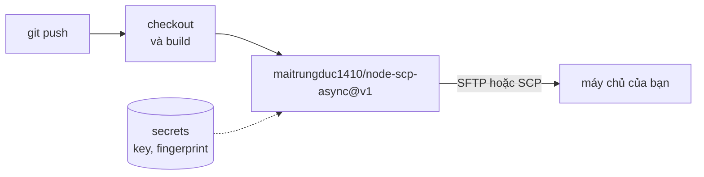

# Deploy từ GitHub Actions

Repository này đồng thời là một GitHub Action. Action chạy CLI của node-scp, nên dùng được với cả
máy chủ SFTP lẫn thiết bị chỉ có SCP.



```yaml
name: Deploy
on:
  push:
    branches: [main]

jobs:
  deploy:
    runs-on: ubuntu-latest
    steps:
      - uses: actions/checkout@v7
      - run: npm ci && npm run build
      - uses: maitrungduc1410/node-scp-async@v1
        with:
          host: ${{ secrets.DEPLOY_HOST }}
          username: deploy
          private-key: ${{ secrets.DEPLOY_KEY }}
          fingerprint: ${{ secrets.DEPLOY_HOST_FINGERPRINT }}
          source: dist/
          target: /var/www/app
          exclude: |
            *.map
            .DS_Store
```

## Input {#inputs}

| Input | Mặc định | Mô tả |
| --- | --- | --- |
| `host` | bắt buộc | Tên host hoặc địa chỉ IP. Hỗ trợ cả IPv6. |
| `port` | `22` | Port SSH. |
| `username` | bắt buộc | Tên người dùng. |
| `private-key` | | Nội dung private key. Hãy dùng secret. |
| `passphrase` | | Passphrase của key. |
| `password` | | Mật khẩu, nếu bạn không dùng được key. |
| `fingerprint` | | Host key mong đợi, dạng `SHA256:...`. Nhiều giá trị thì phân cách bằng dấu phẩy. |
| `source` | bắt buộc | Các đường dẫn cần sao chép, mỗi dòng một đường dẫn. |
| `target` | bắt buộc | Đích. |
| `direction` | `upload` | `upload` hoặc `download`. Khi tải xuống, `source` nằm trên máy chủ còn `target` là cục bộ. |
| `protocol` | `auto` | `auto`, `sftp` hoặc `scp`. |
| `recursive` | `true` | Sao chép thư mục. |
| `preserve` | `false` | Giữ nguyên thời gian và toàn bộ mode. Dù bật hay không, tệp mới vẫn nhận quyền của tệp nguồn. |
| `exclude` | | Các mẫu cần bỏ qua, mỗi dòng một mẫu. Mẫu không chứa `/` sẽ khớp tên ở mọi cấp thư mục. |
| `concurrency` | `4` | Số tệp song song khi dùng SFTP. |
| `version` | `1` | Phiên bản node-scp mà action chạy. |

## Tệp sẽ nằm ở đâu {#where-files-end-up}

Action theo quy tắc của `scp`:

- Với `source: dist` và `target: /var/www/app`, nếu `/var/www/app` chưa tồn tại thì nó trở thành
  bản sao của `dist`; nếu đã tồn tại thì action tạo `/var/www/app/dist`.
- Dấu `/` ở cuối đích (`/var/www/app/`) luôn nghĩa là "vào trong thư mục này".
- Nhiều nguồn thì luôn được sao chép vào trong thư mục đích.

Để thay một thư mục một cách nguyên tử, hãy tải lên một thư mục release mới rồi chuyển symlink
bằng một bước `ssh` sau đó.

## Ghim host key {#pin-the-host-key}

Nếu không có `fingerprint`, action chấp nhận mọi host key và in ra cảnh báo. Hãy lấy giá trị này
một lần từ một mạng tin cậy:

```sh
ssh-keyscan -t ed25519 example.com 2>/dev/null | ssh-keygen -lf -
# 256 SHA256:q7Jx0fT3cM2yKpV9LrWn4sEaB8uHdZ1oGiXe6NcRtYk example.com (ED25519)
```

Lưu `SHA256:q7Jx...` thành secret hoặc variable rồi truyền vào `fingerprint`.

## Dùng trực tiếp CLI {#using-the-cli-directly}

Action chỉ là một lớp bọc mỏng, nên bất kỳ step nào có Node cũng làm được điều tương tự:

```yaml
- run: npx node-scp@1 -r --fingerprint "$FP" dist/ deploy@example.com:/var/www/app
  env:
    NODE_SCP_PRIVATE_KEY: ${{ secrets.DEPLOY_KEY }}
    FP: ${{ vars.DEPLOY_HOST_FINGERPRINT }}
```
