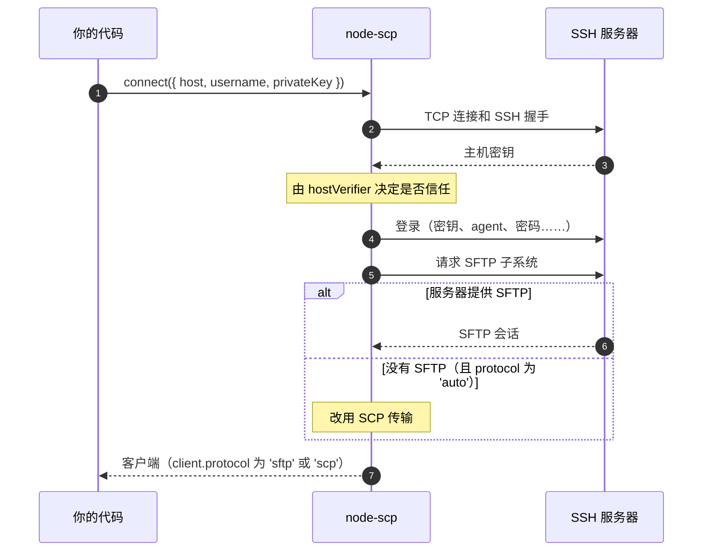

# 连接

`connect()` 返回一个可以直接使用的客户端。在这一次调用背后，会依次发生以下几步：



## 登录 {#log-in}

::: code-group

```ts [私钥]
import { readFileSync } from 'node:fs';

const client = await connect({
  host: 'example.com',
  username: 'deploy',
  privateKey: readFileSync('/home/me/.ssh/id_ed25519'),
});
```

```ts [带口令的私钥]
const client = await connect({
  host: 'example.com',
  username: 'deploy',
  privateKey: readFileSync('/home/me/.ssh/id_ed25519'),
  passphrase: process.env.KEY_PASSPHRASE,
});
```

```ts [ssh-agent]
const client = await connect({
  host: 'example.com',
  username: 'deploy',
  agent: process.env.SSH_AUTH_SOCK,
});
```

```ts [密码]
const client = await connect({
  host: '192.168.1.1',
  username: 'root',
  password: process.env.ROUTER_PASSWORD,
});
```

```ts [Keyboard interactive]
// 有些设备会以提示的方式询问密码。
const client = await connect({
  host: '10.0.0.10',
  username: 'admin',
  tryKeyboard: true,
  beforeConnect: (ssh) =>
    ssh.on('keyboard-interactive', (_name, _instructions, _lang, prompts, finish) =>
      finish(prompts.map(() => password)),
    ),
});
```

:::

`connect()` 接受 [ssh2 客户端](https://github.com/mscdex/ssh2#client-methods)的所有选项，所以 ssh2 能做的事（算法、keepalive、自定义 socket）在这里同样可用。

## 验证主机密钥 {#verify-the-host-key}

主机密钥用来证明你连接的是自己的服务器，而不是中间人。如果你不做校验，ssh2 会接受任何密钥，所以在生产环境中一定要校验：

```ts
import { createHash } from 'node:crypto';

// 在可信网络中获取：ssh-keyscan -t ed25519 example.com | ssh-keygen -lf -
const expected = 'SHA256:q7Jx0fT3cM2yKpV9LrWn4sEaB8uHdZ1oGiXe6NcRtYk';

const client = await connect({
  host: 'example.com',
  username: 'deploy',
  privateKey,
  hostVerifier: (key: Buffer) =>
    `SHA256:${createHash('sha256').update(key).digest('base64').replace(/=+$/, '')}` === expected,
});
```

密钥不匹配时，连接会在发送任何凭据之前失败。[命令行](./cli)和 [GitHub Action](/zh/recipes/github-actions) 通过 `--fingerprint` 做同样的校验。

## 关闭连接 {#close-the-connection}

每个客户端都占用一个打开的 socket，用完后请关闭。

::: code-group

```ts [await using]
{
  await using client = await connect(options);
  await client.upload('./dist', '/var/www/app', { recursive: true });
} // 在这里关闭，出错时也一样
```

```ts [try / finally]
const client = await connect(options);
try {
  await client.upload('./dist', '/var/www/app', { recursive: true });
} finally {
  await client.close();
}
```

:::

`close()` 可以安全地重复调用。连接断开后 `client.closed` 会变为 `true`，网络中断导致的断开也一样；之后的调用会以 `ERR_NOT_CONNECTED` 失败。

## 超时与取消 {#time-limits-and-cancelling}

- `readyTimeout`（默认 20 秒）限制 SSH 握手和登录的时间，同时也限制服务器响应 SFTP 或 SCP 启动所允许的时间。
- `signal` 可以在任意时刻取消整个连接过程：

```ts
const client = await connect({ ...options, signal: AbortSignal.timeout(10_000) });
```

## 通过跳板机连接 {#go-through-a-jump-host}

把另一条 SSH 连接上的流作为 `sock` 传入。[ssh2](https://www.npmjs.com/package/ssh2) 包会随 node-scp 一起安装；如果你直接 import 它，请把它加入自己的依赖。

```ts
import { Client, type ClientChannel } from 'ssh2';
import { connect } from 'node-scp';

const bastion = new Client();
await new Promise<void>((resolve, reject) =>
  bastion.once('ready', resolve).once('error', reject).connect({
    host: 'bastion.example.com',
    username: 'me',
    privateKey,
  }),
);
const sock = await new Promise<ClientChannel>((resolve, reject) =>
  bastion.forwardOut('127.0.0.1', 0, '10.0.0.5', 22, (err, stream) =>
    err ? reject(err) : resolve(stream),
  ),
);

try {
  await using client = await connect({ sock, username: 'deploy', privateKey });
  await client.upload('./dist', '/srv/app', { recursive: true });
} finally {
  bastion.end();
}
```

## node-scp 新增的选项 {#options-node-scp-adds}

| 选项 | 默认值 | 作用 |
| --- | --- | --- |
| `protocol` | `'auto'` | `'auto'`、`'sftp'` 或 `'scp'`。参见[选择协议](./protocols)。 |
| `remoteOs` | `'posix'` | Windows 上的 OpenSSH 服务器请设为 `'win32'`：路径使用反斜杠，引号转义方式对 `cmd.exe` 和 PowerShell 都安全。 |
| `scpCommand` | `'scp'` | 远程的 SCP 程序，例如 `scp` 不在远程 `PATH` 中时设为 `/usr/bin/scp`。 |
| `noDelay` | `true` | 关闭 Nagle 算法，能大幅加快小文件的传输。请保持开启。 |
| `signal` | | 取消连接过程。 |
| `beforeConnect` | | 在连接之前接收 ssh2 客户端，用于添加 `keyboard-interactive` 或 `banner` 等监听器。 |

完整的选项列表（包括继承自 ssh2 的所有选项）见 [`ConnectOptions` 参考](/api/interfaces/ConnectOptions)。
