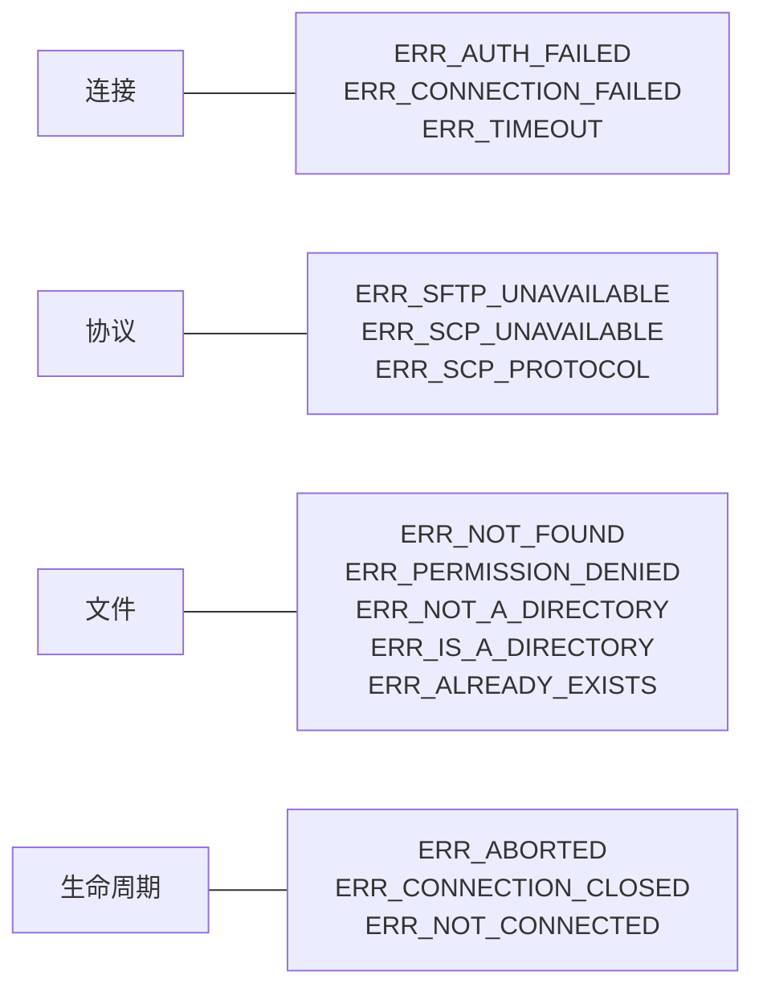

# 错误处理

node-scp 抛出的所有错误都是 `ScpError`，并且提供三个可靠的字段：

```ts
err.code; // 稳定的错误码，例如 'ERR_NOT_FOUND'，SFTP 和 SCP 下相同
err.path; // 涉及的本地或远程路径（如果有）
err.cause; // 来自 ssh2、服务器或本地文件系统的原始错误
```

用 `isScpError()` 按 `code` 分支处理，它还会在 TypeScript 中收窄类型：

```ts
import { ErrorCode, isScpError } from 'node-scp';

try {
  await client.download('/var/log/app.log', './app.log');
} catch (err) {
  if (isScpError(err, ErrorCode.NotFound)) {
    console.log(`nothing at ${err.path} yet`);
  } else {
    throw err;
  }
}
```

`ErrorCode.NotFound` 和字符串 `'ERR_NOT_FOUND'` 是同一个值，用哪个都可以。

## 按出错环节分组的错误码 {#the-codes-grouped-by-what-went-wrong}



| 错误码 | 何时出现 | 怎么处理 |
| --- | --- | --- |
| `ERR_AUTH_FAILED` | 服务器拒绝登录。 | 检查用户名、私钥和密码。 |
| `ERR_CONNECTION_FAILED` | 无法建立 SSH 连接：DNS 解析失败、端口拒绝连接、主机密钥被拒。 | 检查主机、端口、防火墙和 `hostVerifier`。 |
| `ERR_TIMEOUT` | 服务器没有及时响应。 | 对响应慢的设备调大 `readyTimeout`。 |
| `ERR_SFTP_UNAVAILABLE` | 设置了 `protocol: 'sftp'`，但服务器没有 SFTP。 | 改用 `'auto'` 或 `'scp'`。 |
| `ERR_SCP_UNAVAILABLE` | 需要 SCP，但服务器无法运行 `scp`。 | 在设备上启用 SCP，或者设置 `scpCommand`。 |
| `ERR_SCP_PROTOCOL` | 服务器违反了 SCP 协议，或者发来了不安全的文件名。 | 通常是设备的特殊行为；试试去掉 `recursive` 和 `preserve`。 |
| `ERR_NOT_FOUND` | 路径不存在，包括远程父目录不存在。 | 先创建父目录。 |
| `ERR_PERMISSION_DENIED` | 用户没有该位置的读或写权限。 | 检查所有者和权限。 |
| `ERR_NOT_A_DIRECTORY` | 当作目录使用的路径其实是文件。 | |
| `ERR_IS_A_DIRECTORY` | 需要文件的地方是一个目录，或者缺少 `recursive`。 | 加上 `recursive: true`。 |
| `ERR_ALREADY_EXISTS` | 该位置已经存在内容。 | |
| `ERR_ABORTED` | 你的 `signal` 被触发。 | 通常是预期行为；参见[取消传输](./progress#cancel-a-transfer)。 |
| `ERR_CONNECTION_CLOSED` | 操作过程中连接断开。 | 重新连接并重试。 |
| `ERR_NOT_CONNECTED` | 客户端已经关闭。 | 创建新的客户端。 |
| `ERR_INVALID_ARGUMENT` | 选项或路径无效，或者流的长度与声明的 `size` 不符。 | 错误消息会说明具体原因。 |
| `ERR_UNSUPPORTED` | SFTP 服务器不支持该操作。 | |
| `ERR_REMOTE`、`ERR_LOCAL` | 服务器或本机上的其他任何故障。 | 查看 `err.cause`。 |

## 网络不稳定时重试 {#retry-when-the-network-is-flaky}

连接问题值得重试，文件问题则不必：

```ts
const RETRY = new Set([ErrorCode.ConnectionFailed, ErrorCode.ConnectionClosed, ErrorCode.Timeout]);

async function deploy(attempt = 1): Promise<void> {
  try {
    await using client = await connect(options);
    await client.upload('./dist', '/var/www/app', { recursive: true });
  } catch (err) {
    if (attempt < 3 && isScpError(err) && RETRY.has(err.code)) {
      await new Promise((resolve) => setTimeout(resolve, 2 ** attempt * 1000));
      return deploy(attempt + 1);
    }
    throw err;
  }
}
```
