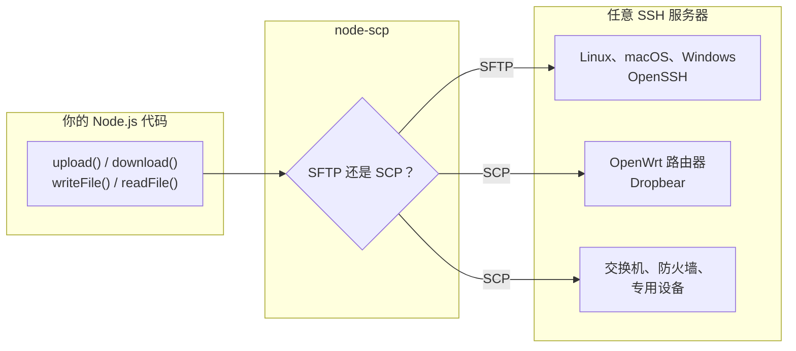

# 什么是 node-scp？

node-scp 用于在 Node.js 程序和任何能通过 SSH 访问的机器之间复制文件。它建立一条 SSH 连接，服务器支持 **SFTP** 时用 SFTP 传输，不支持时用经典的 **SCP** 协议。无论哪种情况，你的代码都不用改。

## 为什么还要再做一个 SSH 文件库？ {#why-another-ssh-file-library}

大多数 Node.js 库只支持 SFTP。对普通的 Linux 服务器来说这没问题，但很多机器根本没有 SFTP 服务器：运行 Dropbear 的 OpenWrt 和其他嵌入式 Linux 设备、网络设备、精简镜像。在这些机器上，SFTP 库会报错 `Unable to start subsystem: sftp`。node-scp 同时实现了 SCP 协议，所以依然可以工作。

除此之外，那些原本需要你自己实现的功能也都已经具备：递归复制、整个目录树的进度、过滤器、用 `AbortSignal` 取消、在两种协议下含义一致的类型化错误，以及命令行工具和 GitHub Action。

## 从哪里开始 {#pick-your-starting-point}

| 我想要…… | 使用 | 阅读 |
| --- | --- | --- |
| 在 Node.js 程序中复制文件 | `connect()` 和客户端方法 | [快速开始](./getting-started) |
| 复制一次就结束 | `upload()` / `download()` 辅助函数 | [单次调用的辅助函数](./transfers#one-call-helpers) |
| 在终端或脚本中复制 | `npx node-scp` | [命令行](./cli) |
| 在 CI 中部署 | `maitrungduc1410/node-scp-async@v1` | [GitHub Action](/zh/recipes/github-actions) |
| 保留为 node-scp 0.x 编写的代码 | `node-scp/legacy` | [从 node-scp 0.x 升级](/zh/migration/from-0.x) |
| 替换 `scp2` 包 | `node-scp/scp2` | [从 scp2 迁移](/zh/migration/from-scp2) |

## 它不适合做什么 {#what-it-is-not}

node-scp 专注于传输文件。如果你的主要工作是执行远程命令，或者需要用到 SFTP 协议的方方面面，其他库可能更合适，[对比页面](/zh/comparison)会告诉你该选哪个。你仍然可以通过 [`client.ssh`](./remote-fs#run-commands) 执行命令，它就是底层的 [ssh2](https://github.com/mscdex/ssh2) 客户端。

## 环境要求 {#requirements}

- 推荐 Node.js 22 或更高版本。Node 20 仍可使用，但已经停止维护。
- 任意 SSH 服务器。SFTP 需要服务器提供 SFTP 子系统，SCP 需要服务器上有 `scp` 程序。几乎所有服务器都至少具备其中之一。
