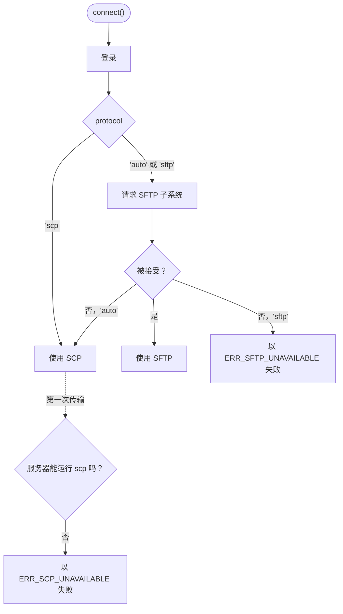

# 选择协议

简短的回答：通常你不需要操心。默认的 `protocol: 'auto'` 会向服务器请求 SFTP，服务器没有时回退到 SCP。`client.protocol` 会告诉你最终用的是哪一种。

<!--@include: ../parts/server-picker.md-->

## `'auto'` 如何做决定 {#how-auto-decides}



SFTP 探测在登录后只需要一次往返。SCP 要到传输时才会尝试，因为每次操作都要在服务器上运行 `scp` 程序。

## 两种协议各有什么 {#what-you-get-with-each}

| | SFTP | SCP |
| --- | --- | --- |
| `upload()`、`download()` | 支持 | 支持 |
| `writeFile()`、`readFile()` | 支持 | 支持（没有 `size` 的流会先缓存到内存） |
| `client.fs`（list、stat、mkdir、rm、rename） | 支持 | 不支持，为 `undefined` |
| 复制目录时并行传输多个文件 | 支持，通过 `concurrency` | 不支持，逐个传输 |
| 下载进度中的 `total` | 有 | 无 |
| 适用于 Dropbear、OpenWrt、网络设备 | 仅当装有 SFTP 服务器时 | 支持 |
| 适用于只提供 SFTP 的主机（`ForceCommand internal-sftp`） | 支持 | 不支持 |

两种协议下的错误码相同，所以无论用的是哪种协议，`ERR_NOT_FOUND` 都表示“不存在”。

## 强制使用某一种 {#force-one}

```ts
// 需要 client.fs 或大量并行文件：没有 SFTP 时尽早失败。
await connect({ ...options, protocol: 'sftp' });

// 确定没有 SFTP 的设备：跳过探测。
await connect({ ...options, protocol: 'scp' });
```

如果 `scp` 不在远程 `PATH` 中，用 `scpCommand: '/usr/bin/scp'` 指定它的位置。

## 想了解背景？ {#want-the-background}

[2026 年该用 SCP 还是 SFTP？](/zh/scp-vs-sftp)介绍了两种协议的工作原理、OpenSSH 9 带来的变化，以及各自仍然占优的场景。
