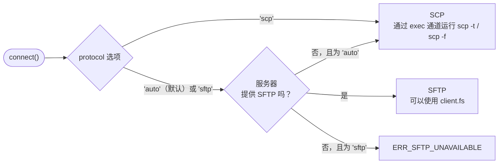

<div class="home-section vp-doc">

## 三行代码复制一个目录 {#copy-a-folder-in-three-lines}

::: code-group

```ts [库]
import { connect } from 'node-scp';

await using client = await connect({ host: 'example.com', username: 'deploy', privateKey });
await client.upload('./dist', '/var/www/app', { recursive: true });
```

```ts [单次调用]
import { upload } from 'node-scp';

await upload('./dist', 'deploy@example.com:/var/www/app', { recursive: true, privateKey });
```

```sh [命令行]
npx node-scp -r ./dist deploy@example.com:/var/www/app
```

```yaml [GitHub Action]
- uses: maitrungduc1410/node-scp-async@v1
  with:
    host: ${{ secrets.DEPLOY_HOST }}
    username: deploy
    private-key: ${{ secrets.DEPLOY_KEY }}
    source: dist/
    target: /var/www/app
```

:::

## 适配你手上的各种服务器 {#works-with-the-servers-you-actually-have}

选择一种服务器，看看 node-scp 会如何处理。

<!--@include: ./parts/server-picker.md-->

## 如何选择协议 {#how-it-picks-the-protocol}



## 在关键场景下更快 {#fast-where-it-matters}

上传到同一台机器上的 OpenSSH，取多次运行的平均值。小文件场景下的差距主要来自 `TCP_NODELAY`，[对比页面](/zh/comparison)有详细解释。

<BenchChart />

</div>
