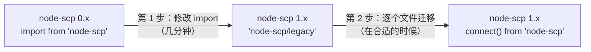

# 从 node-scp 0.x 升级

node-scp 1.0 提供了新的 API。旧 API 仍然随包发布，所以升级分为两步：先改一行代码，然后在合适的时候迁移到新 API。



同一个任务在各个阶段的写法：

::: code-group

```ts [0.x]
import { Client } from 'node-scp';

const client = await Client({ host, username, privateKey });
await client.uploadDir('./dist', '/var/www/app');
client.close();
```

```ts [1.x，第 1 步：legacy]
import { Client } from 'node-scp/legacy';

const client = await Client({ host, username, privateKey });
await client.uploadDir('./dist', '/var/www/app');
await client.close();
```

```ts [1.x，第 2 步：新 API]
import { connect } from 'node-scp';

await using client = await connect({ host, username, privateKey });
await client.upload('./dist', '/var/www/app', { recursive: true });
```

:::

## 第 1 步：保留旧 API {#step-1-keep-the-old-api}

```diff
- import { Client } from 'node-scp';
+ import { Client } from 'node-scp/legacy';
```

或者使用 CommonJS：

```diff
- const { Client } = require('node-scp');
+ const { Client } = require('node-scp/legacy');
```

默认导出同样可用（`import Client from 'node-scp/legacy'`）。0.x 的每个方法都还在，参数和返回值都不变，并且仍然只使用 SFTP。

有几处行为略有不同，全部都是修复：

| 0.x | 1.x 兼容层 |
| --- | --- |
| `ready` 之后发生的连接错误可能以未处理的 `error` 事件导致进程崩溃。 | 只有在你监听 `error` 时才会触发它。 |
| 登录后立即出现的 SFTP 故障会在事件处理函数中抛出并导致崩溃。 | 改为由 `Client()` reject。 |
| `close()` 没有返回值。 | 返回一个 Promise，连接关闭后 resolve。你可以忽略它。 |
| `greeting` 事件被当作 `banner` 触发。 | 以 `greeting` 触发。 |
| `uploadDir` 和 `downloadDir` 逐个复制文件，并跳过符号链接。 | 并行复制四个文件，并跟随符号链接。 |
| `downloadDir` 用 `console.log` 打印被跳过的条目。 | 不打印任何内容。 |
| `uploadDir` 和 `downloadDir` 创建的文件使用另一端的默认 mode。 | 新文件获得源文件的权限位，和 `scp` 一样。已存在的文件保持原有 mode。 |
| `list()` 根据长格式列表的第一个字母判断条目类型，在某些服务器上会出错。 | 类型根据文件 mode 判断。 |

需要 Node.js 20 或更高版本。

## 第 2 步：迁移到新 API {#step-2-move-to-the-new-api}

```ts
import { connect } from 'node-scp';

const client = await connect({ host, username, privateKey });
```

| 0.x | 1.x |
| --- | --- |
| `Client(options)` | `connect(options)` |
| `remoteOsType: 'win32'` | `remoteOs: 'win32'` |
| `events: { banner, ... }` | `beforeConnect: (ssh) => ssh.on('banner', ...)` |
| `uploadFile(local, remote, opts)` | `upload(local, remote)` |
| `downloadFile(remote, local, opts)` | `download(remote, local)` |
| `uploadDir(src, dest)` | `upload(src, dest, { recursive: true })` |
| `downloadDir(src, dest)`，返回一条消息 | `download(src, dest, { recursive: true })`，返回 `{ files, directories, bytes }` |
| `writeFile(path, data)` | `writeFile(path, data)`，也接受流 |
| `readFile(path)` | `readFile(path)` |
| `exists(path)`，返回 `'d'`、`'-'`、`'l'` 或 `false` | `fs.exists(path)`，返回 `'directory'`、`'file'`、`'symlink'`、`'other'` 或 `false` |
| `stat(path)`、`lstat(path)`，返回 ssh2 的 `Stats` | `fs.stat(path)`、`fs.lstat(path)`，返回 `{ type, size, mode, uid, gid, atime, mtime }`，时间为 `Date` |
| `list(path, pattern)` | `fs.list(path)`，再过滤数组 |
| `mkdir(path, attrs, { recursive })` | `fs.mkdir(path, { recursive, mode })` |
| `unlink(path)` | `fs.rm(path)` |
| `rmdir(path)`（总是递归） | `fs.rm(path, { recursive: true })` |
| `emptyDir(path)` | `fs.rm(path, { recursive: true, force: true })`，然后 `fs.mkdir(path)` |
| `rename(from, to)` | `fs.rename(from, to)` |
| `realPath(path)` | `fs.realpath(path)` |
| `chmod`、`chown`、`utimes`、`setstat`、`symlink`、`readlink`、`appendFile` | `client.sftp`（原始的 ssh2 SFTP 会话）上的同名方法 |
| `close()` | `await close()` 或 `await using` |

### 错误 {#errors}

0.x 会直接透传 ssh2 的错误，所以你得知道 SFTP 错误码 `2` 表示“文件不存在”。在 1.x 中，所有错误都是 `ScpError`：

```ts
import { ErrorCode, isScpError } from 'node-scp';

try {
  await client.download('/missing.txt', './missing.txt');
} catch (err) {
  if (isScpError(err, ErrorCode.NotFound)) {
    // ...
  }
}
```

原始错误仍然可以通过 `err.cause` 获取。

### 目标路径是精确的 {#destinations-are-exact}

`upload('dist', '/srv/app', { recursive: true })` 会让 `/srv/app` 成为 `dist` 的副本，与 `uploadDir` 的行为完全相同。父目录（`/srv`）必须存在。对于单个文件，目标就是文件路径，而不是用来放文件的目录。

### 新增的功能 {#new-things-you-get}

- 支持 SCP，同样的代码可以在没有 SFTP 的服务器上运行。
- 每次传输都可以使用 `onProgress`、`filter`、`concurrency`、`preserve` 和 `signal`。
- 用 `await using` 自动清理。
- 接受 `user@host:path` 的单次调用辅助函数 `upload()` 和 `download()`。
