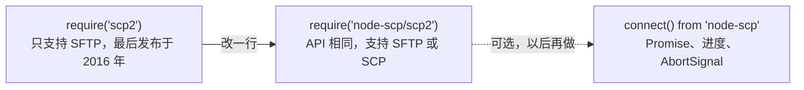

# 从 scp2 迁移

[scp2](https://www.npmjs.com/package/scp2) 自 2016 年以来没有发布过新版本，并且依赖旧版的 ssh2。`node-scp/scp2` 在 node-scp 之上提供了相同的 API：

```diff
- const client = require('scp2');
+ const client = require('node-scp/scp2');
```



ES 模块同样可用：

```js
import scp2, { scp, Client } from 'node-scp/scp2';
```

## 照常可用的部分 {#what-keeps-working}

```js
const { scp, Client } = require('node-scp/scp2');

// 上传一个文件、一个目录或一个 glob。
scp('file.txt', 'admin:password@example.com:/home/admin/', (err) => {});
scp('dist/', 'admin:password@example.com:2222:/var/www/', (err) => {});
scp('data/*.json', { host: 'example.com', username: 'admin', password, path: '/data/' }, cb);

// 下载。
scp('admin:password@example.com:/home/admin/file.txt', './', (err) => {});

// Client 类及其事件和辅助方法。
const client = new Client({ port: 22 });
client.defaults({ host: 'example.com', username: 'admin', privateKey });
client.on('write', ({ source, destination }) => console.log(source, '->', destination));
client.mkdir('/home/admin/new/dir', (err) => {});
client.write({ destination: '/home/admin/data.txt', content: 'hello' }, (err) => {});
client.upload('local.txt', '/home/admin/remote.txt', (err) => client.close());
```

共享的默认客户端（`require('scp2').defaults(...)`、`.upload(...)`、`.close()`）也同样可用。

## 相比 scp2 的改进 {#improvements-over-scp2}

- **支持只有 SCP 的服务器。** scp2 只使用 SFTP。替代品会替你选择 SFTP 或 SCP，所以 Dropbear 和嵌入式设备都能使用。没有 SFTP 时，`mkdir` 会通过 SSH 执行 `mkdir -p`。
- **Promise。** 省略回调时，`scp()`、`upload()`、`download()`、`mkdir()` 和 `write()` 会返回 Promise。
- **可以下载目录**，下载到已存在的目录时会保留文件名。
- **glob 保留目录结构。** `scp('src/**/*.js', ...)` 会在服务器上重建 `src/` 之下的路径。scp2 以第一个匹配项为基准计算路径，可能会把文件放到目标之外。
- **依赖有人维护**，并且自带 TypeScript 类型。

## 细微差异 {#small-differences}

- 上传和下载过程中，`transfer` 事件以 `(null, transferred, total)` 的形式触发。scp2 会把每个原始数据块作为第一个参数传入。`write()` 仍然会传入它的内容。
- glob 模式支持 `*`、`?`、`**`、`[...]` 和 `{a,b}`。以点开头的名称不会被通配符匹配，与 scp2 使用的 `glob` 包一致。
- 在没有 SFTP 的服务器上，`client.sftp(cb)` 会以 `ERR_SFTP_UNAVAILABLE` 失败。
- 错误是带有 `code` 的 `ScpError` 对象，参见[错误处理](/zh/guide/errors)。

## 更进一步：新 API {#going-further-the-new-api}

scp2 兼容层是完整的，所以不必着急。当你反正要修改代码时，主 API 可以为你提供整个目录树的进度、过滤器、取消和类型化错误：

::: code-group

```js [scp2]
const { scp } = require('node-scp/scp2');

scp('dist/', 'deploy:secret@example.com:/var/www/app/', (err) => {
  if (err) console.error(err);
});
```

```js [node-scp]
const { upload } = require('node-scp');

await upload('dist', 'deploy@example.com:/var/www/app', {
  recursive: true,
  password: process.env.DEPLOY_PASSWORD,
});
```

:::

主 API 中目标路径的规则见[上传与下载](/zh/guide/transfers)。
