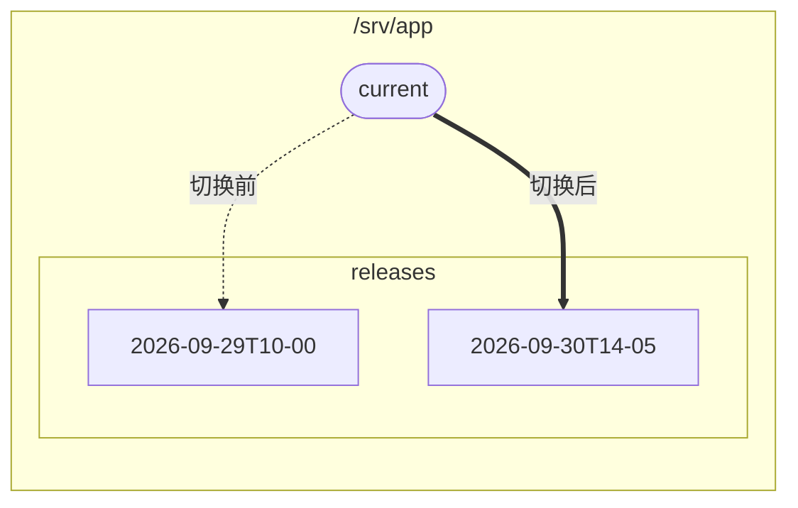

# 零停机部署

直接上传到 Web 服务器正在读取的目录，会有一段时间访客看到的是一半旧文件、一半新文件。经典的解决办法是：每次部署使用一个版本目录，再用一个 `current` 符号链接一步完成切换。



Web 服务器对外提供 `/srv/app/current`。每次部署都在旧版本旁边上传一个新目录，然后让 `current` 指向它。

## 脚本 {#the-script}

```ts
import { readFileSync } from 'node:fs';
import { connect, type ScpClient } from 'node-scp';

const root = '/srv/app';
const release = `${root}/releases/${new Date().toISOString().replace(/[:.]/g, '-')}`;

await using client = await connect({
  host: 'example.com',
  username: 'deploy',
  privateKey: readFileSync(process.env.DEPLOY_KEY_PATH!),
  protocol: 'sftp', // 下面的清理步骤需要 client.fs
});
const fs = client.fs!;

// 1. 在线上版本旁边上传新版本。访客看到的仍是旧版本。
await fs.mkdir(`${root}/releases`, { recursive: true });
await client.upload('./dist', release, { recursive: true });

// 2. 一步切换：先用临时名称创建新链接，再用 rename 覆盖旧链接。
await run(client, `ln -sfn '${release}' '${root}/current.tmp' && mv -Tf '${root}/current.tmp' '${root}/current'`);

// 3. 保留最新的五个版本。
const releases = (await fs.list(`${root}/releases`)).map((entry) => entry.name).sort().reverse();
for (const old of releases.slice(5)) {
  await fs.rm(`${root}/releases/${old}`, { recursive: true });
}

function run(client: ScpClient, command: string): Promise<void> {
  return new Promise((resolve, reject) =>
    client.ssh.exec(command, (err, stream) => {
      if (err) return reject(err);
      stream.resume().stderr.resume();
      stream.on('close', (code: number) => (code === 0 ? resolve() : reject(new Error(`exit ${code}`))));
    }),
  );
}
```

## 为什么这样做 {#why-these-steps}

- **先上传，最后切换。** 如果上传中途失败，线上站点不受影响。重新运行脚本，它会上传一个全新的版本。
- **在 Linux 上，用 `mv -T` 覆盖符号链接是原子操作**：任何时刻 `current` 都指向一个完整的版本。如果用 `rm` 加 `ln` 替换链接，中间会有一瞬间完全没有 `current`。
- **版本名称按时间排序**，所以 `sort().reverse()` 会把最新的排在最前面。
- **回滚**就是同样的切换，只不过指向较旧的目录。

## 在 GitHub Actions 中使用 {#from-github-actions}

用 [GitHub Action](./github-actions) 上传版本，再用一个 `ssh` 步骤切换链接；或者在工作流中用 `node` 运行上面的脚本。
