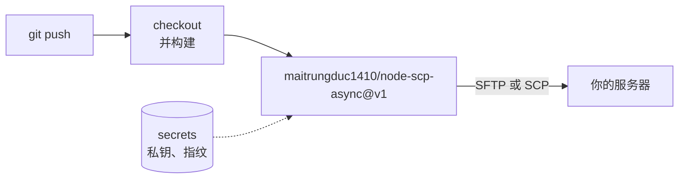

# 从 GitHub Actions 部署

这个仓库同时也是一个 GitHub Action。它运行 node-scp 命令行，所以 SFTP 服务器和只支持 SCP 的设备都能使用。



```yaml
name: Deploy
on:
  push:
    branches: [main]

jobs:
  deploy:
    runs-on: ubuntu-latest
    steps:
      - uses: actions/checkout@v7
      - run: npm ci && npm run build
      - uses: maitrungduc1410/node-scp-async@v1
        with:
          host: ${{ secrets.DEPLOY_HOST }}
          username: deploy
          private-key: ${{ secrets.DEPLOY_KEY }}
          fingerprint: ${{ secrets.DEPLOY_HOST_FINGERPRINT }}
          source: dist/
          target: /var/www/app
          exclude: |
            *.map
            .DS_Store
```

## 输入项 {#inputs}

| 输入项 | 默认值 | 说明 |
| --- | --- | --- |
| `host` | 必填 | 主机名或 IP 地址，也支持 IPv6。 |
| `port` | `22` | SSH 端口。 |
| `username` | 必填 | 用户名。 |
| `private-key` | | 私钥内容。请使用 secret。 |
| `passphrase` | | 私钥的口令。 |
| `password` | | 密码，在无法使用私钥时使用。 |
| `fingerprint` | | 期望的主机密钥，格式为 `SHA256:...`。多个值用逗号分隔。 |
| `source` | 必填 | 要复制的路径，每行一个。 |
| `target` | 必填 | 目标位置。 |
| `direction` | `upload` | `upload` 或 `download`。下载时 `source` 是远程路径，`target` 是本地路径。 |
| `protocol` | `auto` | `auto`、`sftp` 或 `scp`。 |
| `recursive` | `true` | 复制目录。 |
| `preserve` | `false` | 保留时间和完整的 mode。无论是否开启，新文件都会获得源文件的权限。 |
| `exclude` | | 要跳过的模式，每行一个。不含 `/` 的模式会匹配任意层级的名称。 |
| `concurrency` | `4` | SFTP 下并行传输的文件数。 |
| `version` | `1` | Action 运行的 node-scp 版本。 |

## 文件最终放在哪里 {#where-files-end-up}

Action 遵循 `scp` 的规则：

- `source: dist` 和 `target: /var/www/app`：如果 `/var/www/app` 还不存在，它会成为 `dist` 的副本；如果已经存在，则会创建 `/var/www/app/dist`。
- 目标末尾带斜杠（`/var/www/app/`）时，总是表示“放进这个目录”。
- 有多个源时，总是放进目标目录中。

如果要原子地替换一个目录，可以上传到新的版本目录，然后用一个 `ssh` 步骤切换符号链接。

## 固定主机密钥 {#pin-the-host-key}

不提供 `fingerprint` 时，Action 会接受任何主机密钥并打印警告。请在可信网络中获取一次这个值：

```sh
ssh-keyscan -t ed25519 example.com 2>/dev/null | ssh-keygen -lf -
# 256 SHA256:q7Jx0fT3cM2yKpV9LrWn4sEaB8uHdZ1oGiXe6NcRtYk example.com (ED25519)
```

把 `SHA256:q7Jx...` 保存为 secret 或 variable，再作为 `fingerprint` 传入。

## 直接使用命令行 {#using-the-cli-directly}

Action 只是一层很薄的封装，所以任何带有 Node 的步骤都能做到同样的事：

```yaml
- run: npx node-scp@1 -r --fingerprint "$FP" dist/ deploy@example.com:/var/www/app
  env:
    NODE_SCP_PRIVATE_KEY: ${{ secrets.DEPLOY_KEY }}
    FP: ${{ vars.DEPLOY_HOST_FINGERPRINT }}
```
